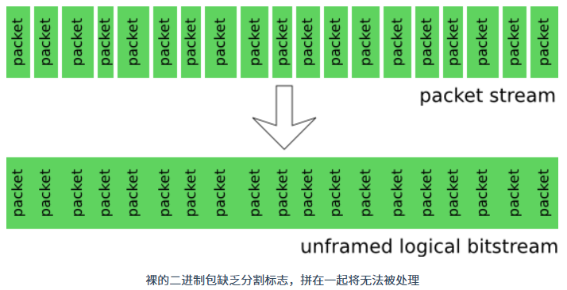

Opus 是一种有损音频编码格式，由 [Xiph.Org](https://xiph.org/) 基金会开发并由 IETF（互联网工程任务组）标准化。它集成了 SILK（以语音编码为主）和CELT（低延迟音乐编码）技术，支持在低比特率下使用线性预测编码（LP），高比特率下使用改进的离散余弦变换（MDCT），并在过渡区间结合两者。Opus 的算法延迟极低（默认22.5 ms，最低可达5 ms），适用于 VoIP、视频会议、游戏内聊天和远程音乐表演等低延迟场景。盲听测试表明，Opus 在压缩效率和延迟上优于 MP3、AAC 和 HE-AAC 等格式。作为开源格式，Opus 无专利限制，可免费使用。

[Opus 编解码器](https://opus-codec.org/)

## 主要特性

Opus 支持从窄带语音到高品质立体声音乐的多种应用场景，其主要特性包括：

- **比特率：**音频数据传输的速度：6 kb/s 至 510 kb/s
- **采样率：**每秒从声音信号中取样的次数：8 kHz 至 48 kHz
- **帧大小：**2.5 ms 至 60 ms（音频数据处理的最小时间单位，单位是毫秒（ms））
- **编码模式**：支持恒定比特率（CBR 数据传输速度固定）和可变比特率（VBR 根据音频内容复杂程度自动调整）
- **音频带宽：**带宽指音频的频率范围：从窄带到全带，窄带频率低，适合语音；全带频率高，适合音乐
- **支持类型：**语音和音乐
- **声道支持：**支持单声道和立体声
- **支持多达 255 个通道（多流帧）：**（通道是指音频的独立音轨，比如立体声有 2 个通道（左、右）
- **动态调整比特率、音频带宽和帧大小**
- **良好的丢包鲁棒性和丢包补偿（PLC）：**在网络传输中，数据包可能会丢失，导致音频断断续续。丢包补偿（PLC）是填补这些“空隙”的技术。
- **支持浮点和定点实现：**计算机处理音频的两种计算方式。浮点适合高性能设备，精度高；定点适合低功耗设备，效率高。

## 不同编码对比


## 编码模式

Opus支持三种操作模式，针对不同场景优化：

- **SILK-only (speech up to wideband)：**仅使用 SILK，适合处理宽带语音（最高 16 kHz 采样率），优化电话通话等场景。
- **Hybrid (super-wideband/fullband speech)：**混合 SILK 和 CELT，适用于超宽带（24 kHz）或全带（48 kHz）语音，兼顾低延迟和高音质。
- **CELT-only (music)：**仅使用 CELT，专为音乐设计，支持全带音频（48 kHz），注重音质细节。

Opus 编码格式应用了两种技术：一个是**线性预测**（Linear Prediction，LP），另一个是**改进的离散余弦变换**（Modified Discrete Cosine Transform，MDCT）。线性预测技术在低频信号的编码上更加高效，适合处理语音数据。对于包含高频信号的音乐，改进的离散余弦变换这种域变换技术处理效率更高。

Opus 编码格式采用的技术不是全新的，它使用的线性预测技术来自于 Skype 发明的 SILK 编解码器，而改进的离散余弦变换技术来自于 CELT （Constrained-Energy Lapped Transform）。CELT 也是由 [Xiph.Org](https://xiph.org/) 基金会早期发明一种音频编码格式，现在合并入 Opus 项目后，就不再有独立的 CELT 格式了。

Opus 中的 CELT 和 SILK 经大量改动后，已与各自原本的版本不再兼容。

## 编码与解码流程


**编码流程**

- **输入（In）**：输入（In）是 **48 kHz** 采样率的音频信号。
- 信号分为两条支路处理：
  - 上支路：经一个延迟（D）为 2.5 ms 的模块后，送入 **CELT 编码器**（CELT 适合处理高频、宽带的音频信号，保持高音质）。
  - 下支路：先通过 “下采样（↓）” 模块，将 48 kHz 信号降采样到 **16 kHz**，再送入 **SILK 编码器**（SILK 更擅长处理语音类信号，在低码率下能较好保留语音特征）。
- 最后，两路编码后的信号通过 **MUX（多路复用器）**整合为一个 “比特流（bit - stream）”，用于后续传输。

**解码流程**

- 传输的 “比特流” 先经 **DEMUX（多路分解器）** 拆分为两路，分别送入 CELT 解码器和 SILK 解码器。
- 解码后：
  - CELT 解码输出直接参与后续合成；
  - SILK 解码输出先通过 “上采样（↑）” 模块，从 16 kHz 恢复到 48 kHz，再与 CELT 解码输出通过 “加法器（+）” 合成。
- 最终得到输出（Out），还原为 48 kHz 采样率的音频信号。

## 音频带宽划分

Opus根据奈奎斯特-香农采样定理（采样率需为信号最高频率的两倍），将音频带宽划分为：


> 根据奈奎斯特采样定理，应用 48 kHz 的采样率，实际上可以处理 24 kHz 以内的音频信号，但是即便如此，Opus 也不会处理超过 20 kHz 的音频，因为超过 20 kHz 的音频人耳已经很难听到了。

Opus 工作在 SILK 模式时，支持 NB、MB、WB 频率带宽的音频，并且帧长在 10ms ~ 60ms 之间。工作在 CELT 模式时，支持 NB、WB、SWB、FB 音频带宽，并且帧长在 2.5ms ~ 20ms 之间。Opus 还可以工作在混合模式（Hybrid），也就是 SILK 和 CELT 同时起作用，这种情况下只支持 SWB 、FB 音频带宽，并且帧长为 10ms 或 20ms。

## Opus包结构

Opus 包结构是 Opus 编码器将音频信号编码后的数据单元，包含编码后的音频数据和用于解码的控制信息。

### TOC字节头

**大小：**每个 Opus 帧以一个 TOC （Table of Contents）字节开头，大小为 1 个字节

**结构：**

```c
 0 1 2 3 4 5 6 7
+-+-+-+-+-+-+-+-+
| config  |s| c |
+-+-+-+-+-+-+-+-+
```

- **config**（5位）：定义编码配置，包括编码模式（SILK、Hybrid、CELT）、音频带宽（NB、MB、WB、SWB、FB）和帧长度（2.5 ms至60 ms）。共 32 种配置。
- **s**（1位）：立体声标志，0 表示单声道，1 表示立体声。
- **c**（2位）：帧数标志，0 表示只包含 1 帧音频，1 表示包含 2 帧等大的音频，2 表示 2 帧不等大的音频，3 表示任意帧数的音频。

前 5 位的配置数定义了 32 种编码配置，不同的编码模式、音频带宽和帧长度组成了这 32 种配置，如下表所示：

| 配置数（config） | 编码模式  | 音频带宽 | 帧长度            |
| :--------------- | :-------- | :------- | :---------------- |
| 0...3            | SILK-only | NB       | 10, 20, 40, 60 ms |
| 4...7            | SILK-only | MB       | 10, 20, 40, 60 ms |
| 8...11           | SILK-only | WB       | 10, 20, 40, 60 ms |
| 12...13          | Hybrid    | SWB      | 10, 20 ms         |
| 14...15          | Hybrid    | FB       | 10, 20 ms         |
| 16...19          | CELT-only | NB       | 2.5, 5, 10, 20 ms |
| 20...23          | CELT-only | WB       | 2.5, 5, 10, 20 ms |
| 24...27          | CELT-only | SWB      | 2.5, 5, 10, 20 ms |
| 28...31          | CELT-only | FB       | 2.5, 5, 10, 20 ms |

### 帧长度编码

这个长度编码仅部分需要。

**大小：**

- 0 号包和 1 号包：无需额外帧长度编码（0字节）。
- 2 号包：1–2 字节，用于编码第一个帧的字节数。
- 3号包（VBR）：VBR 模式下需用 1-2 字节分别标注前 M-1 个子帧的长度（最后一个靠计算得出不需要编码），CBR 模式下因所有子帧大小相同，无需单独标注每个子帧长度。

**编码规则：**

- 1 字节：值 0 表示无数据（DTX或丢失），1–251表示帧字节数。
- 2 字节：首字节252–255时，帧字节数 =（第二字节×4）+ 首字节，最大 1275 字节（510 kbit/s）。
- 因此一个帧的最大长度为：255 * 4 + 255 = **1275** 字节。对于一个 20ms 的帧来说，这个长度代表 510 kbit/s 的码率。这个码率几乎是立体声音乐的有损压缩编码最高有效码率。超过这个码率，最好采用无损编码。这也是 MDCT 算法的最高有效码率，超过这个值，在增加码率进行编码，音频的质量也不会跟着提高。

```c
//========================= 0 号包 ===============================
 0                   1                   2                   3
 0 1 2 3 4 5 6 7 8 9 0 1 2 3 4 5 6 7 8 9 0 1 2 3 4 5 6 7 8 9 0 1
+-+-+-+-+-+-+-+-+-+-+-+-+-+-+-+-+-+-+-+-+-+-+-+-+-+-+-+-+-+-+-+-+
| config  |s|0|0|                                               |
+-+-+-+-+-+-+-+-+                                               |
|                    Compressed frame 1 (N-1 bytes)...          :
:                                                               |
|                                                               |
+-+-+-+-+-+-+-+-+-+-+-+-+-+-+-+-+-+-+-+-+-+-+-+-+-+-+-+-+-+-+-+-+
    
//========================= 1 号包 ===============================
 0                   1                   2                   3
 0 1 2 3 4 5 6 7 8 9 0 1 2 3 4 5 6 7 8 9 0 1 2 3 4 5 6 7 8 9 0 1
+-+-+-+-+-+-+-+-+-+-+-+-+-+-+-+-+-+-+-+-+-+-+-+-+-+-+-+-+-+-+-+-+
| config  |s|0|1|                                               |
+-+-+-+-+-+-+-+-+                                               :
|             Compressed frame 1 ((N-1)/2 bytes)...             |
:                               +-+-+-+-+-+-+-+-+-+-+-+-+-+-+-+-+
|                               |                               |
+-+-+-+-+-+-+-+-+-+-+-+-+-+-+-+-+                               :
|             Compressed frame 2 ((N-1)/2 bytes)...             |
:                                               +-+-+-+-+-+-+-+-+
|                                               |
+-+-+-+-+-+-+-+-+-+-+-+-+-+-+-+-+-+-+-+-+-+-+-+-+   
    
//========================= 2 号包 ===============================   
 0                   1                   2                   3
 0 1 2 3 4 5 6 7 8 9 0 1 2 3 4 5 6 7 8 9 0 1 2 3 4 5 6 7 8 9 0 1
+-+-+-+-+-+-+-+-+-+-+-+-+-+-+-+-+-+-+-+-+-+-+-+-+-+-+-+-+-+-+-+-+
| config  |s|1|0| N1 (1-2 bytes):                               |
+-+-+-+-+-+-+-+-+-+-+-+-+-+-+-+-+                               :
|               Compressed frame 1 (N1 bytes)...                |
:                               +-+-+-+-+-+-+-+-+-+-+-+-+-+-+-+-+
|                               |                               |
+-+-+-+-+-+-+-+-+-+-+-+-+-+-+-+-+                               |
|                     Compressed frame 2...                     :
:                                                               |
|                                                               |
+-+-+-+-+-+-+-+-+-+-+-+-+-+-+-+-+-+-+-+-+-+-+-+-+-+-+-+-+-+-+-+-+
    
//========================= 3 号包 ===============================  
 0 1 2 3 4 5 6 7
+-+-+-+-+-+-+-+-+
|v|p|     M     |
+-+-+-+-+-+-+-+-+
// v 等于 0 表示 CBR，等于 1 表示 VBR。
// p 等于 1 表示包里面含有填充字节。
// M 表示包里面含有的帧个数。    
```

当处于 3 号包的时候有可能需要**填充长度编码（可选，仅p=1时）**

**大小：**单字节或多字节

- 值为1–254：表示填充字节数。
- 值为255：表示254字节填充，后续字节继续编码更多填充字节数。
- 规定一个包所包含的音频长度不能超过 120ms，如果按最小的帧长 2.5ms 计算，一个包的音频包所含有的音频帧不会超过 48 个。

```c
//========================= CBR =============================== 
// 对于 CBR 编码，R = N-2-P(表示填充字节的总数) 就是有效音频数据的字节数。包里面每个音频帧的字节数量为 R/M
0                   1                   2                   3
 0 1 2 3 4 5 6 7 8 9 0 1 2 3 4 5 6 7 8 9 0 1 2 3 4 5 6 7 8 9 0 1
+-+-+-+-+-+-+-+-+-+-+-+-+-+-+-+-+-+-+-+-+-+-+-+-+-+-+-+-+-+-+-+-+
| config  |s|1|1|0|p|     M     |  Padding length (Optional)    :
+-+-+-+-+-+-+-+-+-+-+-+-+-+-+-+-+-+-+-+-+-+-+-+-+-+-+-+-+-+-+-+-+
|                                                               |
:               Compressed frame 1 (R/M bytes)...               :
|                                                               |
+-+-+-+-+-+-+-+-+-+-+-+-+-+-+-+-+-+-+-+-+-+-+-+-+-+-+-+-+-+-+-+-+
|                                                               |
:               Compressed frame 2 (R/M bytes)...               :
|                                                               |
+-+-+-+-+-+-+-+-+-+-+-+-+-+-+-+-+-+-+-+-+-+-+-+-+-+-+-+-+-+-+-+-+
|                                                               |
:                              ...                              :
|                                                               |
+-+-+-+-+-+-+-+-+-+-+-+-+-+-+-+-+-+-+-+-+-+-+-+-+-+-+-+-+-+-+-+-+
|                                                               |
:               Compressed frame M (R/M bytes)...               :
|                                                               |
+-+-+-+-+-+-+-+-+-+-+-+-+-+-+-+-+-+-+-+-+-+-+-+-+-+-+-+-+-+-+-+-+
:                  Opus Padding (Optional)...                   |
+-+-+-+-+-+-+-+-+-+-+-+-+-+-+-+-+-+-+-+-+-+-+-+-+-+-+-+-+-+-+-+-+
    
//========================= VBR ===============================
// 对于 VBR 编码，填充长度字节的后面跟上了 M - 1 个帧长度的编码，每个帧长度都会用一到两个字节做如前面所述的帧长度编码
 0                   1                   2                   3
 0 1 2 3 4 5 6 7 8 9 0 1 2 3 4 5 6 7 8 9 0 1 2 3 4 5 6 7 8 9 0 1
+-+-+-+-+-+-+-+-+-+-+-+-+-+-+-+-+-+-+-+-+-+-+-+-+-+-+-+-+-+-+-+-+
| config  |s|1|1|1|p|     M     | Padding length (Optional)     :
+-+-+-+-+-+-+-+-+-+-+-+-+-+-+-+-+-+-+-+-+-+-+-+-+-+-+-+-+-+-+-+-+
: N1 (1-2 bytes): N2 (1-2 bytes):     ...       :     N[M-1]    |
+-+-+-+-+-+-+-+-+-+-+-+-+-+-+-+-+-+-+-+-+-+-+-+-+-+-+-+-+-+-+-+-+
|                                                               |
:               Compressed frame 1 (N1 bytes)...                :
|                                                               |
+-+-+-+-+-+-+-+-+-+-+-+-+-+-+-+-+-+-+-+-+-+-+-+-+-+-+-+-+-+-+-+-+
|                                                               |
:               Compressed frame 2 (N2 bytes)...                :
|                                                               |
+-+-+-+-+-+-+-+-+-+-+-+-+-+-+-+-+-+-+-+-+-+-+-+-+-+-+-+-+-+-+-+-+
|                                                               |
:                              ...                              :
|                                                               |
+-+-+-+-+-+-+-+-+-+-+-+-+-+-+-+-+-+-+-+-+-+-+-+-+-+-+-+-+-+-+-+-+
|                                                               |
:                     Compressed frame M...                     :
|                                                               |
+-+-+-+-+-+-+-+-+-+-+-+-+-+-+-+-+-+-+-+-+-+-+-+-+-+-+-+-+-+-+-+-+
:                  Opus Padding (Optional)...                   |
+-+-+-+-+-+-+-+-+-+-+-+-+-+-+-+-+-+-+-+-+-+-+-+-+-+-+-+-+-+-+-+-+    
```

### 帧数据

根据一个包的 TOC 字节中帧数（c）的不同取值，我们把这个包命名为：**c 号包**。

**大小：**

- 0 号包：N-1 字节（N为包总字节数）。
- 1 号包：(N-1)/2 字节 per frame（两帧等大）。
- 2 号包：N1 字节（第一帧）+ 剩余字节（第二帧）。
- 3 号包：每帧大小依 CBR（R/M 字节，R = N-2-P，M 为帧数，P 为填充字节数）或 VBR（N1, N2, ..., N[M] 字节）确定。
- 最大单帧 1275 字节（510 kbit/s）。

**合法音频包的验证条件**

根据前面描述，我们可以通过以下几个约束条件来判断一个 Opus 包是否合法：

1. 音频包至少包含一个字节，即 TOC 字节。
2. 一个音频帧的长度不能超过 1275 字节。
3. 1 号音频包的字节数必须是奇数，使得 (N-1)/2 计算出来是整数。
4. 2 号音频包的 TOC 字节后面必须有足够的字节数用于编码帧长度，而且帧长度不能大于音频包剩下的字节数。
5. 3 号音频包至少包含一个音频帧，但是总的音频长度不得超过 120ms。
6. CBR 的 3 号包至少包含 2 个字节。添加在音频包后面的填充字节数和表示填充长度的字节数之和 P 不能大于 N-2，而且 (N-2-P) 是帧个数 M 的倍数。
7. VBR 的 3 号包必须足够大到容纳所有的包头字节，以及对应的前 M-1 个帧的长度，和填充字节数。

### 带分界的音频包

如前所述，Opus 包与包之间没有界限，需要额外的机制告诉解码器每个包的大小。不过除此之外，Opus 标准还定义了一种**带分界**（Self-Delimiting）的音频包，编码器拿到这种包可以直接推断出包的大小。

从前面描述的 0 ~ 3 号包结构来看，对于包含 CBR 的包，由于每个帧长度一样，只需要再添加一个帧的长度编码就可以确定这个包的总大小；对于 VBR 的包，由于包里面已经含有了除最后一个帧的长度编码，只需要再添加最后一帧的长度编码就可以算出包的总大小。不管哪种情况，这个长度编码都采用前面提到的 1 ~ 2 字节的**帧长度编码**。下面分别描述 0 ~ 3 号包是如何添加这个长度编码的。

对于 0 号包，在 TOC 字节后面，添加帧长度编码，表示后面这个帧的大小。

```c
 0                   1                   2                   3
 0 1 2 3 4 5 6 7 8 9 0 1 2 3 4 5 6 7 8 9 0 1 2 3 4 5 6 7 8 9 0 1
+-+-+-+-+-+-+-+-+-+-+-+-+-+-+-+-+-+-+-+-+-+-+-+-+-+-+-+-+-+-+-+-+
| config  |s|0|0| N1 (1-2 bytes):                               |
+-+-+-+-+-+-+-+-+-+-+-+-+-+-+-+-+                               |
|               Compressed frame 1 (N1 bytes)...                :
:                                                               |
|                                                               |
+-+-+-+-+-+-+-+-+-+-+-+-+-+-+-+-+-+-+-+-+-+-+-+-+-+-+-+-+-+-+-+-+
```

对于 1 号包，在 TOC 字节后面，添加帧长度编码，表示后面每个帧的大小。如果这个编码的值为 N1，那么后面两个帧的总大小为 2 * N1。

```c
 0                   1                   2                   3
 0 1 2 3 4 5 6 7 8 9 0 1 2 3 4 5 6 7 8 9 0 1 2 3 4 5 6 7 8 9 0 1
+-+-+-+-+-+-+-+-+-+-+-+-+-+-+-+-+-+-+-+-+-+-+-+-+-+-+-+-+-+-+-+-+
| config  |s|0|1| N1 (1-2 bytes):                               |
+-+-+-+-+-+-+-+-+-+-+-+-+-+-+-+-+                               :
|               Compressed frame 1 (N1 bytes)...                |
:                               +-+-+-+-+-+-+-+-+-+-+-+-+-+-+-+-+
|                               |                               |
+-+-+-+-+-+-+-+-+-+-+-+-+-+-+-+-+                               :
|               Compressed frame 2 (N1 bytes)...                |
:                                               +-+-+-+-+-+-+-+-+
|                                               |
+-+-+-+-+-+-+-+-+-+-+-+-+-+-+-+-+-+-+-+-+-+-+-+-+
```

对于 2 号包，在第一帧数据前面，添加第二帧的长度编码，表示第二帧的大小。如果这个编码的值为 N2，那么两个帧的总大小为 N1 + N2。（Opus 默认小端排序）

```c
 0                   1                   2                   3
 0 1 2 3 4 5 6 7 8 9 0 1 2 3 4 5 6 7 8 9 0 1 2 3 4 5 6 7 8 9 0 1
+-+-+-+-+-+-+-+-+-+-+-+-+-+-+-+-+-+-+-+-+-+-+-+-+-+-+-+-+-+-+-+-+
| config  |s|1|0| N1 (1-2 bytes): N2 (1-2 bytes):               |
+-+-+-+-+-+-+-+-+-+-+-+-+-+-+-+-+-+-+-+-+-+-+-+-+               :
|               Compressed frame 1 (N1 bytes)...                |
:                               +-+-+-+-+-+-+-+-+-+-+-+-+-+-+-+-+
|                               |                               |
+-+-+-+-+-+-+-+-+-+-+-+-+-+-+-+-+                               |
|               Compressed frame 2 (N2 bytes)...                :
:                                                               |
+-+-+-+-+-+-+-+-+-+-+-+-+-+-+-+-+-+-+-+-+-+-+-+-+-+-+-+-+-+-+-+-+
```

对于 CBR 的 3 号包，在第一帧前面，添加帧长度编码，表示后面每个帧的大小。如果这个编码的值为 N1，那么后面 M 个帧的总大小为 M * N1。

```c
 0                   1                   2                   3
 0 1 2 3 4 5 6 7 8 9 0 1 2 3 4 5 6 7 8 9 0 1 2 3 4 5 6 7 8 9 0 1
+-+-+-+-+-+-+-+-+-+-+-+-+-+-+-+-+-+-+-+-+-+-+-+-+-+-+-+-+-+-+-+-+
| config  |s|1|1|0|p|     M     | Pad len (Opt) : N1 (1-2 bytes):
+-+-+-+-+-+-+-+-+-+-+-+-+-+-+-+-+-+-+-+-+-+-+-+-+-+-+-+-+-+-+-+-+
|                                                               |
:               Compressed frame 1 (N1 bytes)...                :
|                                                               |
+-+-+-+-+-+-+-+-+-+-+-+-+-+-+-+-+-+-+-+-+-+-+-+-+-+-+-+-+-+-+-+-+
|                                                               |
:               Compressed frame 2 (N1 bytes)...                :
|                                                               |
+-+-+-+-+-+-+-+-+-+-+-+-+-+-+-+-+-+-+-+-+-+-+-+-+-+-+-+-+-+-+-+-+
:                              ...                              :
+-+-+-+-+-+-+-+-+-+-+-+-+-+-+-+-+-+-+-+-+-+-+-+-+-+-+-+-+-+-+-+-+
|                                                               |
:               Compressed frame M (N1 bytes)...                :
|                                                               |
+-+-+-+-+-+-+-+-+-+-+-+-+-+-+-+-+-+-+-+-+-+-+-+-+-+-+-+-+-+-+-+-+
:                  Opus Padding (Optional)...                   |
+-+-+-+-+-+-+-+-+-+-+-+-+-+-+-+-+-+-+-+-+-+-+-+-+-+-+-+-+-+-+-+-+
```

对于 VBR 的 3 号包，在第一帧前面，添加帧长度编码，表示最后一个帧的大小。如果这个编码的值为 N[M]，那么后面 M 个帧的总大小为 N1 + N2 + ... + N[M]。

```c
 0                   1                   2                   3
 0 1 2 3 4 5 6 7 8 9 0 1 2 3 4 5 6 7 8 9 0 1 2 3 4 5 6 7 8 9 0 1
+-+-+-+-+-+-+-+-+-+-+-+-+-+-+-+-+-+-+-+-+-+-+-+-+-+-+-+-+-+-+-+-+
| config  |s|1|1|1|p|     M     | Padding length (Optional)     :
+-+-+-+-+-+-+-+-+-+-+-+-+-+-+-+-+-+-+-+-+-+-+-+-+-+-+-+-+-+-+-+-+
: N1 (1-2 bytes):     ...       :     N[M-1]    |     N[M]      :
+-+-+-+-+-+-+-+-+-+-+-+-+-+-+-+-+-+-+-+-+-+-+-+-+-+-+-+-+-+-+-+-+
|                                                               |
:               Compressed frame 1 (N1 bytes)...                :
|                                                               |
+-+-+-+-+-+-+-+-+-+-+-+-+-+-+-+-+-+-+-+-+-+-+-+-+-+-+-+-+-+-+-+-+
|                                                               |
:               Compressed frame 2 (N2 bytes)...                :
|                                                               |
+-+-+-+-+-+-+-+-+-+-+-+-+-+-+-+-+-+-+-+-+-+-+-+-+-+-+-+-+-+-+-+-+
:                              ...                              :
+-+-+-+-+-+-+-+-+-+-+-+-+-+-+-+-+-+-+-+-+-+-+-+-+-+-+-+-+-+-+-+-+
|                                                               |
:              Compressed frame M (N[M] bytes)...               :
|                                                               |
+-+-+-+-+-+-+-+-+-+-+-+-+-+-+-+-+-+-+-+-+-+-+-+-+-+-+-+-+-+-+-+-+
:                  Opus Padding (Optional)...                   |
+-+-+-+-+-+-+-+-+-+-+-+-+-+-+-+-+-+-+-+-+-+-+-+-+-+-+-+-+-+-+-+-+
```

从上面的描述我们可以看到，实际上这个额外的帧长度编码都是在原来的包结构基础上，插入到了第一帧数据的前面。

在一些场景下，带分界包有实际的用途。根据标准，Opus 只能编码单声道或者双声道立体声音频。因此一个 Opus 码流要不就是单声道的，要不就是双声道的。如果要传输或者存储多声道（大于2）的音频，就需要复合多个 Opus 流。例如 5.1 环绕立体声有 6 个声道，传输或者存储这样一个音频，可能需要组合多个单声道或双声道的 Opus 流。

假如 5.1 环绕立体声由 2 个双声道，2 个单声道的 Opus 流组成。那么需要将这 4 个 Opus 流复合成一个流，每次从 4 个 Opus 流中各取一个包，组成一个复合音频包。每个复合音频包就包含四个包，分别来自同一时刻不同的 Opus 流。为了让解码器能够顺利从复合音频包中识别出四个包，就需要让前三个包采用带分界格式的编码。一般来说复合包的总大小会通过容器格式或者传输协议信息告诉解码器，因此复合包里面最后一个子 Opus 包不需要采用带分界包格式，可以直接推断出来。

## Ogg

Opus 编码后的音频数据只是单纯的音频比特流，这些包之间通常没有分割标志，缺乏文件结构和必要的元数据等信息；如果直接把这些包拼接在一起形成一个二进制流，那么没有任何解码器可以读出其中的包并进行解码，因为解码器将找不到每个包从哪里开始，从哪里结束。

Ogg 是 [Xiph.Org](https://xiph.org/) 基金会推出的一种开源免费的多媒体容器格式。Ogg 容器格式可以用于封装音频、视频、字幕、以及多媒体元信息。它既适用于流媒体传输，又能作为文件格式存储多媒体。



Ogg 容器格式将多媒体编码器产生的二进制包进行封装，并且提供分割信息，这样解码器就可以通过读取 Ogg 格式的封装信息，将二进制包一个一个拆出来进行解码。

### 逻辑流与物理流

我们将编码器生成的二进制流称为**逻辑流**（Logical Bitstream），把 Ogg 封装之后二进制流称为**物理流**（Physical Bitstream）。之所以这么称呼是因为编码生成的裸二进制流实际上无法被任何工具处理，只能存在于逻辑概念，而 Ogg 封装过后的流却是可以被实际操作处理的。


Ogg 物理流的基本组成单位是 **Ogg 页**（Ogg Page）。编码器输出的二进制包就是按照 Ogg 格式的规则放到 Ogg 页中的。Ogg 的规范十分灵活，一个 Ogg 页可以存放一个包、多个包、甚至是一包的一部分。正因为 Ogg 格式对编码器输出的包大小没有要求，使得 Ogg 格式可以用于多种视频、音频编码格式的封装。

一个 Ogg 物理流中可以包含多个逻辑流，例如一个 Ogg 文件中包含了视频、音频以及字幕三个逻辑流。如果一个Ogg流只有一个逻辑流，那么它称为一个**基础流** （Elementary Bitstream），如果包含多个逻辑流，那么它称为**复合流**（Multiplexed Bitstream）。

多个基础流通过 Ogg 页交错的方式组合成一个复合流，也就是将不同基础流中同样时间点的 Ogg 页放到一起。


### Ogg媒体类型定义

针对 Ogg 格式，Xiph.Org 在 IANA 注册了三种 MIME 类型。分别是：

- application/ogg
- video/ogg
- audio/ogg

在标准制定的早期，Ogg 专门用来封装 Vorbis 编码格式的语音，并且在 [RFC3534](https://tools.ietf.org/html/rfc3534) 中定义了 application/ogg 类型来指代封装在 Ogg 格式中的Vorbis语音。不过随着技术的发展，Ogg 被单独提出来作为一种可以封装任意媒体类型的容器格式。于是 [RFC3534](https://tools.ietf.org/html/rfc3534) 草案被废弃，在新的草案 [RFC5334](https://tools.ietf.org/html/rfc5334) 中重新定义了 application/ogg 的意义，并且定义了 video/ogg 和 audio/ogg 两种新的类型。

**video/ogg**

当一个 Ogg 流的主要信息是视频（可能包括音频和字幕），那么传输的时候应当使用 video/ogg 类型。存储成文件时应当使用 .ogv 扩展名。

**audio/ogg**

当一个 Ogg 流的主要信息是音频（可能包括字幕），那么传输的时候应当使用 audio/ogg 类型。存储成文件时应当使用 .oga扩展名。

因为历史原因，Ogg 格式的音频数据存储成文件时，也可以使用 .ogg 和 .spx 扩展名。.ogg 表示音频编码格式是 Vorbis；.spx 表示音频编码格式是 Speex。

**application/ogg**

当一个 Ogg 流非常复杂，不是单纯的视频或者音频，例如传输多路视频信号，这种情况下就建议使用 application/ogg 类型。存储文件使用 .ogx 扩展名。

对于这些 MIME 类型，还可以指定 codec 参数来表示 Ogg 流中的数据编码格式。例如传输Opus格式语音就可以使用：audio/ogg;codecs=opus。目前支持的 codec 可以参考 [MIMETypesCodecs - XiphWiki](https://wiki.xiph.org/index.php/MIMETypesCodecs)

### Ogg页的格式

Ogg 页是 Ogg 物理流的基本单位。一个 Ogg 页由头和负载两部分组成，并且总是由 OggS 四个字节开头，这四个字节称为捕获标志（Capture Pattern）。当客户端解码器从中途开始接收服务端推送的流媒体比特流时，搜索到比特流中的第一个 OggS 标志，就可以从这里开始进行比特流的解码。负载部分就是实际承载的**媒体数据内容**


#### 捕获标志

```c
byte value
 0   0x4f  'O'
 1   0x67  'g'
 2   0x67  'g'
 3   0x53  'S'
```

固定值 OggS。

#### 版本号（Version）

```c
byte value
 4   0x00
```

Ogg 格式的版本号，目前固定为 0。

#### 头类型标志（Header Type）

```c
byte value
 5   bitflags: 0x01: 置0 = 从新的包开始
                     置1 = 这个页里面的包接着上一个页里面的包
               0x02: 置0 = 不是逻辑流的第一个 Ogg 页
                     置1 = 逻辑流的第一个 Ogg 页（bos）
               0x04: 置0 = 不是逻辑流的最后一个 Ogg 页
                     置1 = 逻辑流的最后一个 Ogg 页（eos）
```

占一个字节，根据最低的三个比特位是否设置为1表示不同的信息。

这里特别说明一下最低位 0x01 的意义，当一个包太大，导致一个  Ogg 页放不下，或者 Ogg 页已经放了很多个包，剩下的位置不够再放一个包，那么一个包就可能横跨两个连续的 Ogg 页。这个包开头的部分在第一页，后半部分在第二页。这种情况下，第二页的头类型标志的最低位就会置为 1。

#### 位置数（Granule Position）

```c
byte value
 6   0xXX LSB
 7   0xXX
 8   0xXX
 9   0xXX
10   0xXX
11   0xXX
12   0xXX
13   0xXX MSB
```

从上面的字节序可以看出位置数采用小端字节序，这也是 Ogg 的默认字节序。

每个 Ogg 页上的位置数表示从这个逻辑流开始，到这个 Ogg 页上最后一个完结的包所包含的样本数。如果一个包只有开头或中间的一部分在这个 Ogg 页里面，那么这部分的包含的样本数不计算在位置数里面。

如果这个值为 -1（以补码表示），那么说明这个页里面没有任何完结的包。

下面用一个例子来说明位置数。一个逻辑流由 6 个包组成，这个包按照下图的方式封装在4个Ogg页里面形成一个Ogg物理流。

- Ogg 页 1 里面包2是这个页里面最后一个完结的包，从开头的包1开始算起，到这个包2一共有40个样本，因此Ogg页1的位置数为40。
- Ogg 页 2 里面没有任何一个包是在该页结束的，因此位置数为-1。
- Ogg 页 3 里面最后一个完结的包是包4，从开始到包 4结尾一共有 120 个样本数，因此 Ogg 页 3 的位置数为 120。
- Ogg 页 4 里面最后一个完结的包是包6，从开始到包 6 结尾一共有 160 个样本数，因此 Ogg 页 4 的位置数为 160。


对于不同类型的多媒体和编解码器，位置数的含义不一样，例如对于视频来说，它表示帧数，对于音频来说，它表示采样数。

#### 逻辑流编号（Bitstream Serial Number）

```c
byte value
14   0xXX LSB
15   0xXX
16   0xXX
17   0xXX MSB
```

当多个逻辑流复合在一个 Ogg 物理流里面时，每个逻辑流都会有一个独特的编号，其对应的 Ogg 页都打上对应编号，用于区分这个 Ogg 页属于哪一个逻辑流。

#### 页序列号（Page Sequence No）

```c
byte value
18   0xXX LSB
19   0xXX
20   0xXX
21   0xXX MSB
```

Ogg 流里面每个 Ogg 页都有一个按顺序增长的序号，这样如果在传输的时候有一页丢失了，解码器可以通过检查序号很快发现丢失的页。

如果一个 Ogg 物理流里面有多个逻辑流，那么每个逻辑流的 Ogg 页序列号是独立增长的。

#### 校验和（Checksum）

```c
byte value
22   0xXX LSB
23   0xXX
24   0xXX
25   0xXX MSB
```

当前整个 Ogg 页的 CRC 校验和，计算包括头部数据，只是在计算前将校验和字段的四个字节置为 0，计算后将得到的值再设置进去。

计算时，初始值和最后的异或（XOR）值为 0，生成多项式为：0x04c11db7（Ogg 默认）。

#### 分段个数（Page Segments）、分段表（Segment Table）

```c
byte value
26   0x00-0xff (0-255)
```

```c
byte value
27   0x00-0xff (0-255)
[...]
n    0x00-0xff (0-255, n=page_segments+26)
```

Ogg 格式规定将一个包看成由多个大小为 255 字节的分段和最后一个可能小于 255 字节分段组成。例如一个包的大小为 702 字节，那么可以看是由三个分段组成大小分别为：255、255、192。如果将这个包封装到Ogg页中，那么Ogg头里面的**分段个数**值为 3，**分段表**将有三个字节，值分别为：255、255、192。

**分段个数**占一个字节，表示这个 Ogg 页里面有多少个包的分段。**分段表**的大小由**分段个数**决定，其中每个字节的值代表了对应分段的大小。

这个分段机制为解码器提供了区分包边界的方法，如果分段表中一个值小于255，那么代表这个包已经结束了，下一个分段就代表一个新的包开始。

用一个例子来说明这个机制，下图有三个包存储在了两个 Ogg 页中。


- 包 1 大小为 702 字节，可以分成三个段：255、255、192。
- 包 2 大小为 574 字节，可以分成三个段：255、255、64。
- 包 3 大小为 638 字节，可以分成三个段：255、255、128。

Ogg 页 1 包含整个包 1 和包 2 的前两个分段，因此 Ogg 页 1 头里面的分段个数字段的值为 5，分段表有 5 个字节，5 个字节的值分别为：255、255、192、255、255。当解码器读到分段表中 192 这个数时，就知道这个包已经结束，可以开始解码包 1 的数据了。

Ogg 页 2 包含整个包 3 和包 2 的最后一个分段，因此 Ogg 页 2 头里面的分段个数字段的值为 4，分段表有 4 个字节，4 个字节的值分别为：64、255、255、128。并且由于 Ogg 页 2 开头的数据是接着上一个 Ogg 页的，因此它头类型标志最低位将会设置为 1。

有种特殊情况，如果一个包大小恰好为 255 的倍数，例如包大小为 510，如果按照上面的分段方法，那么应该分成两段：255、255。但是这样依赖，解码器在分段表里面读到第二个 255，并不能判断这个包是不是结束了。为了解决这个问题，Ogg 规定在分段表里面插入一个 0 值，也就是说这个包可以看成分成三个段：255、255、0。解码器读到这个 0 的时候就知道这个包结束了。这个 0 值只存在于分段表中，不会真的在负载的包中插入数据。

从上面的分析可以看出 Ogg 格式对包的分段只是逻辑上的，只是用于计算分段个数和分段表中的值，并不会在负载中的包里面插入任何分隔符。

由于分段个数只占一个字节，它的最大值为 255，分段表中每个分段值也只占一个字节，对应的分段大小最大为 255 字节。因此一个 Ogg 页的最大有效负载为 255 * 255 = 65025 字节，这种情况下，Ogg 页的头大小为 ：27（固定大小） + 255（分段表大小） = 282 字节。整个 Ogg 页最大的长度为 65025 + 282 = 65307。

这个逻辑上的分段机制可以看出，虽然 Ogg 页的大小有限制，但是对于多媒体编码器输出的包大小没有限制，大于65025字节的包可以分开在多个连续的Ogg页里面存储，分段机制保证了解码器可以识别到包的开始和结尾。

## Ogg封装Opus音频流

Opus 编码后的音频流不方便存储和传输，Ogg 作为一种容器格式，提供了封装 Opus 音频流的方法。封装之后音频流方便存储和传输，并且提供了一些关键特性，包括元数据，快速而精准的定点播放，封装只需要很少额外数据开销，而且方便与其它的数据流（例如视频）复合。

### Ogg封装Opus流的包结构

Ogg 流是由一个一个 Ogg 页（Ogg Page）组成的，每个 Ogg 页封装了来自一个或者多个“数据包”的数据。“数据包”如果太大，有可能会分散到多个 Ogg 页中。“数据包”如果比较小，一个 Ogg 页也有可能包含多个数据包。“数据包”不一定是指音频数据，也有可能是元数据等等。

一个 Ogg 封装的 Opus 音频流的格式如下图所示：

```c
 Page 0         Pages 1 ... n        Pages (n+1) ...
+------------+ +---+ +---+ ... +---+ +-----------+ +---------+ +--
|            | |   | |   |     |   | |           | |         | |
|+----------+| |+-----------------+| |+-------------------+ +-----
|| ID Header|| ||  Comment Header || ||Audio Data Packet 1| | ...
|+----------+| |+-----------------+| |+-------------------+ +-----
|            | |   | |   |     |   | |           | |         | |
+------------+ +---+ +---+ ... +---+ +-----------+ +---------+ +--
^      ^                           ^
|      |                           |
|      |                           Mandatory Page Break
|      ID header is contained on a single page
'Beginning Of Stream'
```

在这个流中，有两个数据包是必须的。第一个包是 **ID 头**（ID Header），这个包不是 Opus 音频包，它所携带的信息表明了这个二进制流是 Opus 音频。这个 ID 头独占第一个 Ogg 页，这一页不会包含其它数据，而且 ID 头的大小也不会超过一个 Ogg 页。第一页的 Ogg 头类型标志中的 bos 标志将会被置为 1，表示逻辑流的开始。

逻辑流中的第二个必须的包叫做**注解头**（Comment Header），其中包含了用户创建流时提供的元信息，例如标题、发行时间、艺术家名字等等。注解头从逻辑流的第二个 Ogg 页开始，有可能太大会占据多个页，并且它结尾的那个 Ogg 页不能包含别的包的数据。

后续的 Ogg 页都是音频数据页，里面包含**音频包**（Audio Data Packet）。这里要特别说明一下音频包的含义。一个音频包并不等同于一个 Opus 编码输出的 Opus 包（Opus Packet）。Opus 编码器最只可以编码单声道或者双声道立体声，所以一个 Opus 包最多包含两个声道的数据。如果要用 Opus 编码多声道环绕立体声，那么只能组合多个单声道或者双声道的 Opus 流来实现。例如一个 5.0 环绕立体声可能由 3 个 Opus 流组合而成：2 个双声道，加上一个单声道 Opus 流。

假设一个多声道音频流由 N 个 Opus 流组成，把 N 个流在同一时间点上的 N 个 Opus 包组合在一起就形成一个**音频包**。为了在一个音频包里面区分出 N 个 Opus 包，一个音频包里面前 （N-1）个 Opus 包采用[**带分界（Self-Delimiting）的包格式**](https://tools.ietf.org/html/rfc6716#appendix-B)，最后一个包采用标准 Opus 包格式。另外需要注意的是一个音频包里面的所有 Opus 包代表的时间长度必须相同。


对于单声道或者双声道立体声，N 通常为 1，对于多声道音频来说 N 大于 1。N 的具体值定义在了 ID 头里面，并且在整个 Ogg 逻辑流里面保持不变。

> 根据声道数，音频一般分为单声道音频（mono）、双声道立体声音频（stereo）、多声道环绕立体声音频（multichannel surround）。

#### **ID 头**（ID Header）

**ID 头**（ID Header）包含的数据至关重要，只要理解了里面每个字段的意思，就基本理解了 Ogg 是如何封装 Opus 的。

```c
 0 1 2 3 4 5 6 7 8 9 0 1 2 3 4 5 6 7 8 9 0 1 2 3 4 5 6 7 8 9 0 1
+-+-+-+-+-+-+-+-+-+-+-+-+-+-+-+-+-+-+-+-+-+-+-+-+-+-+-+-+-+-+-+-+
|      'O'      |      'p'      |      'u'      |      's'      |
+-+-+-+-+-+-+-+-+-+-+-+-+-+-+-+-+-+-+-+-+-+-+-+-+-+-+-+-+-+-+-+-+
|      'H'      |      'e'      |      'a'      |      'd'      |
+-+-+-+-+-+-+-+-+-+-+-+-+-+-+-+-+-+-+-+-+-+-+-+-+-+-+-+-+-+-+-+-+
|  Version = 1  | Channel Count |           Pre-skip            |
+-+-+-+-+-+-+-+-+-+-+-+-+-+-+-+-+-+-+-+-+-+-+-+-+-+-+-+-+-+-+-+-+
|                     Input Sample Rate (Hz)                    |
+-+-+-+-+-+-+-+-+-+-+-+-+-+-+-+-+-+-+-+-+-+-+-+-+-+-+-+-+-+-+-+-+
|   Output Gain (Q7.8 in dB)    | Mapping Family|               |
+-+-+-+-+-+-+-+-+-+-+-+-+-+-+-+-+-+-+-+-+-+-+-+-+               :
|                                                               |
:               Optional Channel Mapping Table...               :
|                                                               |
+-+-+-+-+-+-+-+-+-+-+-+-+-+-+-+-+-+-+-+-+-+-+-+-+-+-+-+-+-+-+-+-+
```

上图是 ID 头的格式。下面详细解释每个字段的意思。

**魔数（Magic Signature）**

这是 8 个固定的字节，其内容为 OpusHead。

**版本号（Version）**

占 1 个字节，表示版本号，目前版本号的值始终为 1。可以把这个版本号看作两部分，高 4 位为主版本号，低 4 位为次版本号。如果主版本号不相同，那么表示两个版本的格式不兼容。

**输出声道数（Output Channel Count）**

占 1 个字节，表示解码这个音频流需要输出的声道个数，我们把这个声道数记为 C。

前面我们提到过，一个 Ogg 封装的音频流可能包含 N 个 Opus 音频流。这个输出声道数 C 并不等于 N，而是可以取任意值。由于 Opus 的特性，即便是同一个 Opus 流，里面每个包所代表的声道数都可能不一样，每个 Opus 包的声道数都由其开头的 TOC 字节中的 s 标志指定，如下图所示， 0 表示单声道，1 表示双声道立体声。

```c
 0 1 2 3 4 5 6 7
+-+-+-+-+-+-+-+-+
| config  |s| c |
+-+-+-+-+-+-+-+-+
```

编码的时候，编码器会根据输入的 PCM 数据，以及当前编码音频帧的特性，来决定当前编码输出到底是单声道还是双声道。解码的时候，解码一个 Opus 流到底输出一个声道还是两个声道，并不会根据 TOC 中 s 的指示的来输出，实际上因为每个包 s 取值都有可能不同，也不能根据它来解码。而是根据需求，配置解码器，让它解码成单声道或者双声道。**当解码配置为单声道，而某个 Opus 包是双声道数据时，解码器会将两个声道的数据求平均合成一个声道的数据。如果解码配置为双声道，而某个 Opus 包是单声道数据时，解码器将单声道数据复制成两个声道的数据**。

因为一个 Ogg 流中有 N 个 Opus 流，具体对每个 Opus 流如何解码，是根据**声道映射类**（Channel Mapping Family）和**声道映射表**（Channel Mapping Table）共同决定的。

**流开头可跳过的 PCM 采样数：Pre-Skip**

由于 Opus 编码的某些原因，编码器会在音频的开头插入一些无用的 PCM 采样，解码器会解码这些采样，但是解码后会丢弃掉这些 PCM 采样，不播放它们。

Ogg 页的位置数包含了这些插入在前面的 PCM 采样数。要计算实际的 PCM 采样数，应当采取如下公式：

```c
实际 PCM 采样数 = 位置数 - 前置插入 PCM 采样数
```

播放器上应当显示的播放时间为：

$$
播放时间 = \frac{实际 PCM 采样数}{48000.0}
$$


在 ID 头里面有一个 pre-skip 字段，它的值就等于编码器插入的无用 PCM 采样数。

**输入采样率（Input Sample Rate）**

占 4 个字节，以小端法表示的无符号整数。代表编码前原始输入的 PCM 采样率。但是并不代表解码后播放语言的采样率。

对于 Opus 这种有损编码来说，编码的时候并不会保留原始的采样率，在编码的时候会根据每个帧的特征决定采用哪种采样率编码。因此同一个流中每个 Opus 包应用采样率可能都不一样，每个包的采样率和对应的带宽由 TOC 字节中的 config 定义。在解码播放的时候，根据下面的实际情况，按照某种采样率解码：

- 如果硬件支持 48 kHz，那么按照 48 kHz 解码。
- 如果硬件最高支持的采样率是某个 Opus 支持的采样率（8kHz，12kHz，16kHz，24kHz，48kHz），那么按照这个支持的采样率解码。
- 如果硬件最高支持的采样率小于 48 kHz，那么选择一个刚好大于硬件采样率的 Opus 支持的采样率解码，解码后重采样成硬件需要的采样率。
- 其它情况使用 48 kHz 解码，然后重采样。

当需要将 Ogg Opus 解码输出成 PCM 文件时，输出的 PCM 文件可以按照这个**输入采样率**来存储。这样解码输出文件保持和原始输入 PCM 一样的采样率，可以让用户不至于困惑。

由于**输入采样率**对解码并没有多大意义，因此它的值也可以设置为 0，表示未定义。

**输出增益（Output Gain）**

占 2 个字节，以小端法表示的有符号数。代表解码时，应用到每个采样的增益，单位为 dB。这个数采用 [Q7.8](https://en.wikipedia.org/wiki/Q_(number_format)) 格式表示，16 位中有 8 位代表小数部分，是个有符号的浮点数。假如增益倍数为 ，按照 dB 的定义，那么这个**输出增益**的值就为 ：$20 \log_{10} x$

假如输出增益的值为 a，解码得到某个 PCM 采样的值为 y，那么应用这个增益得到的值 p 可用如下公式计算得到：
$$
p = y \times 10^{\frac{a}{20 \times 256}}
$$
播放器应用这个增益之后会改变声音的音量。

**声道映射类（Channel Mapping Family）**

占 1 个字节，无符号整数。定义了声道映射的类别。目前只能取值为 0、1、255。根据取值 x，我们把它称为**第 x 类声道映射**。其具体意思在后面解释。

**声道映射表（Channel Mapping Table）**

占多个字节。当**声道映射类**不为 0 时，ID 头里面才包含这个**声道映射表**。其具体意思在下一节解释。

#### 注解头（Comment Header）

注解头的结构比较简单，如下图所示：

```c
 0 1 2 3 4 5 6 7 8 9 0 1 2 3 4 5 6 7 8 9 0 1 2 3 4 5 6 7 8 9 0 1
+-+-+-+-+-+-+-+-+-+-+-+-+-+-+-+-+-+-+-+-+-+-+-+-+-+-+-+-+-+-+-+-+
|      'O'      |      'p'      |      'u'      |      's'      |
+-+-+-+-+-+-+-+-+-+-+-+-+-+-+-+-+-+-+-+-+-+-+-+-+-+-+-+-+-+-+-+-+
|      'T'      |      'a'      |      'g'      |      's'      |
+-+-+-+-+-+-+-+-+-+-+-+-+-+-+-+-+-+-+-+-+-+-+-+-+-+-+-+-+-+-+-+-+
|                     Vendor String Length                      |
+-+-+-+-+-+-+-+-+-+-+-+-+-+-+-+-+-+-+-+-+-+-+-+-+-+-+-+-+-+-+-+-+
|                                                               |
:                        Vendor String...                       :
|                                                               |
+-+-+-+-+-+-+-+-+-+-+-+-+-+-+-+-+-+-+-+-+-+-+-+-+-+-+-+-+-+-+-+-+
|                   User Comment List Length                    |
+-+-+-+-+-+-+-+-+-+-+-+-+-+-+-+-+-+-+-+-+-+-+-+-+-+-+-+-+-+-+-+-+
|                 User Comment #0 String Length                 |
+-+-+-+-+-+-+-+-+-+-+-+-+-+-+-+-+-+-+-+-+-+-+-+-+-+-+-+-+-+-+-+-+
|                                                               |
:                   User Comment #0 String...                   :
|                                                               |
+-+-+-+-+-+-+-+-+-+-+-+-+-+-+-+-+-+-+-+-+-+-+-+-+-+-+-+-+-+-+-+-+
|                 User Comment #1 String Length                 |
+-+-+-+-+-+-+-+-+-+-+-+-+-+-+-+-+-+-+-+-+-+-+-+-+-+-+-+-+-+-+-+-+
:                                                               :
```

注解头也是以 8 个字节的固定**魔数**（Magic Signature）开头，其值固定为 OpusTags。

**厂商字符串长度**（Vendor String Length）占 4 个字节，是小端法表示的无符号整数。它代表后面**厂商字符串**（Vendor String）的长度，厂商字符串不包含 null 结尾的字节。厂商字符串用于存储编解码器和封装容器的名字等相关信息。

**注解列表长度**（User Comment List Length）占 4 个字节，是小端法表示的无符号整数。它表示后面注解的个数。其中每个注解由两部分组成，一个是**注解字符串长度**（User Comment String Length），另一个是**注解字符串**（User Comment String）。

注解字符串使用 NAME=value 的格式，注解标签名与 [Vorbis 格式](https://www.xiph.org/vorbis/doc/v-comment.html)中定义的一样，包含了：ARTIST、TITLE、DATE、ALBUM，等等。

### 位置数（Granule Position）

根据 Ogg 格式的标准，每个 Ogg 页的头部都有一个位置数字段。位置数至关重要，它代表当前页音频数据的播放时间点。包含 ID 头和包含注解头结尾的两个 Ogg 页的位置数为 0，这是因为这两个包不是音频，因此不占用播放时间。音频 Ogg 页的位置数是从音频流开始到当前页中最后一个完结音频包所包含的总 PCM 采样数。如果一个 Ogg 页里面没有一个完结的包，那么这个页的位置数为 -1（以补码的形式编码）。

音频 Ogg 页的位置数记录的是按照 48kHz 的采样率解码得到的 PCM 采样数。（并且是按照一个声道的采样数来计算。同样时间长度的音频，多声道的位置数并不比单声道的大）。解码器也可以按照其它采样率来解码，但是因为 Opus 编码时使用的采样率都能被 48kHz 除尽，因此一律按照 48kHz 的解码采样率来计算位置数是一种简单有效的办法。

根据 Opus 标准的规定，一个音频帧最小为 2.5ms，一个 Opus 包最多包含 48 个帧，因此一个 Opus 包的时间长度为 2.5ms 到 120ms 之间，而且长度肯定是 2.5ms 的倍数。 一个帧的时间长度被编码在了 Opus 包开头的 TOC 字节里。解码器解码一帧数据返回的 PCM 采样数一定是和这个时间长度对应的。例如一个 20ms 的帧，按照 48kHz 采样率解码后的采样个数是 960。

根据 Ogg 页上的位置数，解码器可以通过向前或者后项查询，给每个解码得到的 PCM 采样分配一个位置数编号。

**对第一个位置数的限制**

对于第一个包含包尾的音频 Ogg 页，其位置数有可能大于实际解码得到的 PCM 采样数。因为有可能是从实时语言流的中间开始接收音频。

**尾部可丢弃的采样数**

最后一个 Ogg 页，也就是设置了 eos 标志的页，它的位置数可能比实际解码出来的 PCM 采样数小。那么最后多出来的那些 PCM 采样就可以丢弃掉。

## 声道映射（Channel Mapping）

前面我们提到了，一个 Ogg 流里面封装了 N 个 Opus 流。通过声道映射表的定义，这 N 个 Opus 流可以解码出 M + N 个声道。最后根据之前**输出声道数**的定义可以输出 C 个声道。

除了第 0 类声道映射，在 ID 头里面都编码了如下的声道映射表：

```c
 0 1 2 3 4 5 6 7 8 9 0 1 2 3 4 5 6 7 8 9 0 1 2 3 4 5 6 7 8 9 0 1
                                                +-+-+-+-+-+-+-+-+
                                                | Stream Count  |
+-+-+-+-+-+-+-+-+-+-+-+-+-+-+-+-+-+-+-+-+-+-+-+-+-+-+-+-+-+-+-+-+
| Coupled Count |              Channel Mapping...               :
+-+-+-+-+-+-+-+-+-+-+-+-+-+-+-+-+-+-+-+-+-+-+-+-+-+-+-+-+-+-+-+-+
```

第一个字节是 **Opus 流个数 “N”**（Stream Count），为无符号整数，表示这个 Ogg 流中封装了 N 个 Opus 流。也意味着一个音频包中包含了 N 个 Opus 包。N 不能为 0。

第二个字节是**双声道 Opus 流个数 “M”**（Coupled Stream Count），为无符号整数。这个数 M 必须小于等于 N，它告诉解码器每个音频包中前 M 个 Opus 包按照双声道来解码，剩下的 N - M 个 Opus 包按照单声道解码。因此解码出来的总声道数为 M + N，总声道数不能大于 255。

**声道映射关系**（Channel Mapping）占 C 个字节。每个字节对应一个输出声道，它的值表示解码出来声道与输出声道的对应关系。这个表就相当于建立了 M + N 个解码声道与 C 个输出声道的关系。假设某个字节的值为 index，这个值要么是小于 M + N 的，要么等于特殊值 255。假如 index 小于 2*M，那么解码出的第 index/2 个 Opus 流是个双声道流，如果 index 是偶数，输出声道就取这个流的左声道，如果是奇数，就取右声道。假如 index 大于 2×M 且小于 255，那么解码出的第 index - M 个 Opus 流是单声道的，那么输出声道就取自这个流。如果 index 等于 255，那么输出声道就是纯粹的静音。


输出声道数 C 并不一定要等于解码声道数 M + N。相同的 index 值可能会多次出现，也就是说多个输出声道对应相同的解码声道，同时有些解码声道没有对应的输出声道。

每个声道映射类所允许的声道个数和含义都不一样，下面详细介绍各个声道映射类对应的声道含义。

### 第 0 类声道映射

允许的声道个数：1 或者 2。表示单声道或者双声道音频。

对于第 0 类声道映射来说，ID 头里面不包含声道映射字段。它的 N 默认等于 1，表示 Ogg 流里面只封装了一个 Opus 流。C 等于 1 或者 2，表示输出单声道或者双声道，M 等于 C - 1。因此可以看出，输出声道就对应这个 Opus 流按照单声道或者双声道解码出来的 1 个声道或者 2 个声道。

### 第 1 类声道映射

允许的声道个数为：1 到 8。每个声道对应不同的扬声器排列方式，其输出声道排列如下：

- 1 个声道：单声道。
- 2 个声道：双声道立体声。声道排列：左声道，右声道。
- 3 个声道：线性环绕立体声。声道排列：左声道，中声道，右声道。
- 4 个声道：四声道环绕立体声。声道排列：左前声道，右前声道，左后声道，右后声道。
- 5 个声道：5.0 环绕立体声。声道排列：左前声道，中前声道，右前声道，左后声道，右后声道。
- 6 个声道：5.1 环绕立体声。声道排列：左前声道，中前声道，右前声道，左后声道，右后声道，低音效（LFE）声道。
- 7 个声道：6.1 环绕立体声。声道排列：左前声道，中前声道，右前声道，左侧声道，右侧声道，中后声道，低音效（LFE）声道。
- 8 个声道：7.1 环绕立体声。声道排列：左前声道，中前声道，右前声道，左侧声道，右侧声道，左后声道，右后声道，低音效（LFE）声道。

这些声道的排列和含义和 Vorbis 格式是一样的，但是和 WAV 和 FLAC 格式不一样。如果需要在这些格式之间做转换，那么需要注意重新排列声道顺序。

### 第 255 类声道映射

允许的声道个数为：1 到 255。但是每个声道没有特别的含义。播放器一般不会播放这一类音频流。某些软件的实现可以将每个声道存储成单独的 PCM 文件，但是对于 index 值为 255 的声道是不输出任何文件的，因为这代表着静音。

### 未定义的声道映射类

声道映射类 2 到 254 是保留的类，目前没有任何特殊含义。
