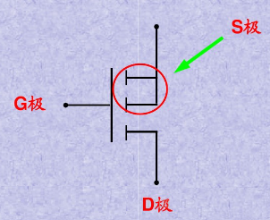
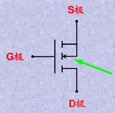
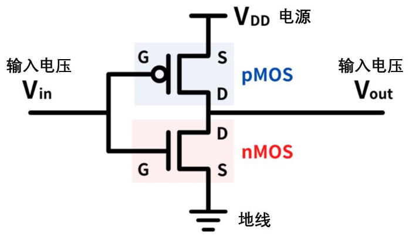
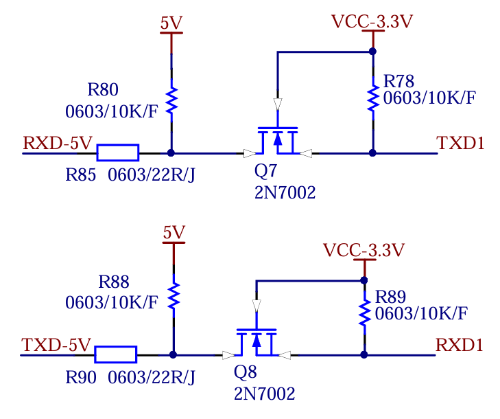
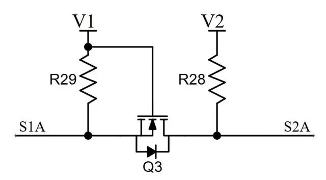

MOS管(Metal-Oxide-Semiconductor Field-Effect Transistor，MOSFET)是一种广泛应用于电子电路中的场效应晶体管（FET）。它利用**电场效应**来控制电流流动，是数字和模拟电路中常见的元件。MOS 管凭借其高输入阻抗和低功耗特性，在功率开关、信号放大以及逻辑电路中有着广泛的应用。

## 结构

MOS管主要由三部分构成：

1. **栅极（Gate）**：这是 MOS管的控制端，通过在栅极施加电压来控制电流的导通与关断。栅极和通道之间由一层薄薄的绝缘氧化物层（通常是二氧化硅）隔开，因此栅极与其他区域几乎没有电流流动。
2. **源极（Source）**：MOSFET 的一个高掺杂端子，通常连接到较低电位（N 沟道）或较高电位（P 沟道）。在 N 沟道 MOSFET 中，电流从漏极流向源极；在 P 沟道 MOSFET 中，电流从源极流向漏极。源极的定义取决于电路的偏置电压。
3. **漏极（Drain）**：MOSFET 的另一个高掺杂端子，与源极共同构成电流路径。漏极的角色由接线方式决定，在某些电路中可能与源极互换。
4. **衬底（Body or Substrate）**：指 MOSFET 中最底层的半导体材料部分，P型衬底（掺杂硼等，使其带正电荷载流子——空穴）或 N型衬底（掺杂磷等，使其带负电荷载流子——电子）；衬底的掺杂类型和浓度直接影响沟道的形成条件和器件的工作电压（如阈值电压）。 

MOS 管通常分为 **N沟道（N-Channel）**和 **P沟道（P-Channel）**两种类型，分别根据导电通道是由 N 型还是 P 型半导体形成来区分。

> G极(gate)—栅极，不用说比较好认
>
> S极(source)—源极，不论是P沟道还是N沟道，两根线相交的就是
>
> D极(drain)—漏极，不论是P沟道还是N沟道，是单独引线的那边
>
> 在某些电路中，理论上 MOSFET 的源极和漏极可以互换使用。然而，在实际制造过程中，由于器件结构的限制，会在源极和漏极之间形成一个体二极管。这个体二极管是 MOSFET 制造工艺中天然产生的，无法完全避免。因此，在实际应用中，源极和漏极并不能互换使用。

## 沟道判别

> 箭头指向G极的是N沟道
> 箭头背向G极的是P沟道

## 工作原理

MOS 管是一种**电压控制器件**，它的工作状态由**栅极的电压**来控制。当在栅极和源极之间施加一定的电压时，栅极通过电场影响沟道区域的电荷分布，从而控制源极和漏极之间的电流流动。

- **N 沟道 MOS 管（NMOS）**：当栅极电压高于源极电压（即正偏压）时，导电沟道形成，电流从漏极流向源极。这个过程称为导通。
- **P 沟道 MOS 管（PMOS）**：与 NMOS 相反，当栅极电压低于源极电压（即负偏压）时，导电沟道形成，电流从源极流向漏极。

## cMOS

cMOS是结合了nMOS 和pMOS 的电路结构，继承了 MOS管低功耗、高速运行的特点，是现代半导体器件的基本结构。

利用 cMOS 就可以实现最基本的反相器。

## 电平转换电路

5V 与 3.3V 互转就是一个比较常见的 MOS管用例电路：下图是一个利用串口通信时候 3.3V 与 5V 互转的一个案例

电路连接如下:
**栅极（G）**：通过 R89（10kΩ）连接到 VCC-3.3V，因此栅极电压 V_G = 3.3V（固定)。
**漏极（D）**：通过 R90（22Ω）连接到 TXD-5V，TXD-5V 通过 R88（10kΩ)上拉到 5V。
**源极（S）**：连接到 RXD1，RXD1 通过 R89 上拉到 3.3V。
**输入信号**：TXD-5V，5V 逻辑电平（0V 或 5V)。
**输出信号**：RXD1，3.3V 逻辑电平（0V 或 3.3V)。

MOSFET 导通条件
N 沟道增强型 MOSFET（如 2N7002）的导通条件是：
栅源电压（V_GS）必须大于阈值电压（V_th）。
对于 2N7002，V_th 典型值约为 1.6V（根据数据手册，范围在 1V 至 2.5V 之间）。

### 体二极管

体二极管是 N 沟道或 P 沟道 MOSFET 内部的寄生二极管，由主体（Body）和源极/漏极之间的 PN 结形成。

**导通条件**
**正向偏置**：体二极管导通的必要条件是 **源极电压（V_S）高于漏极电压（V_D）**，且两者的电压差超过 PN 结的正向导通电压（约 0.7V）。(Vs - VD > VF)
**反向偏置**：当 $ V_D > V_S $ 时，体二极管处于反向偏置状态，不导通（除非反向电压超过击穿电压）。

