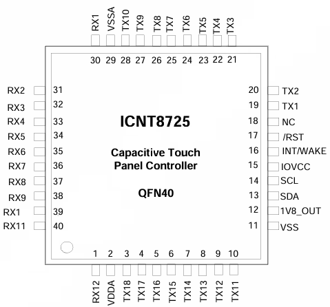
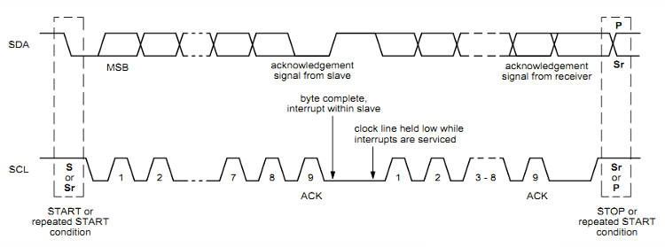
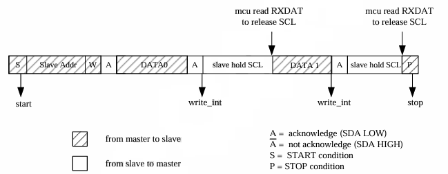
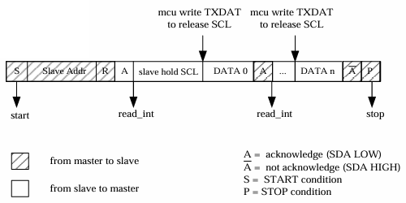
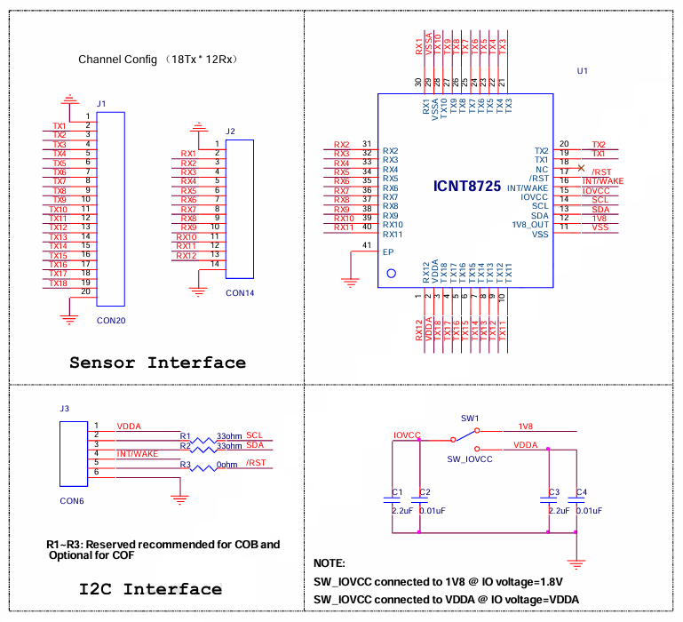
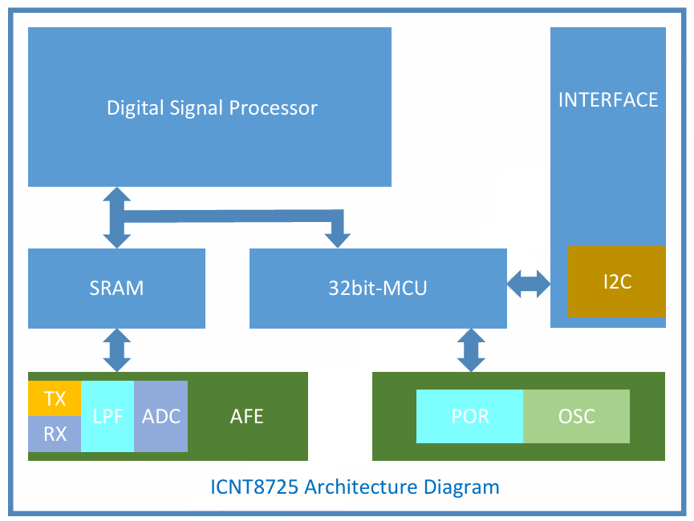
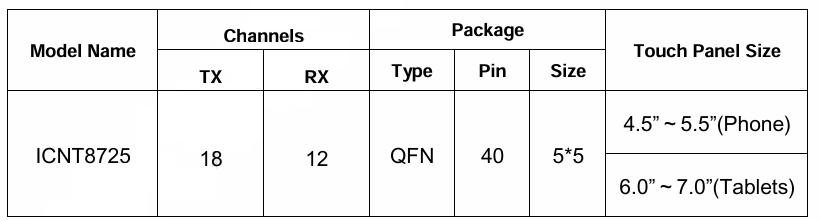

ICNT8725 是一款低功耗的互电容式触摸控制器，内置 32位 MCU 和 DSP(数字信号处理器)，配备 4KB SRAM，支持**多达 10 点真多点触摸**，**适用于 4.5 至 7.0 英寸的手机和平板触摸屏**。它兼容玻璃/薄膜 DITO、SITO 和 OGS 结构，以及单层多点 ITO 传感器，提供 I2C 接口（最高 400kbps）与主机通信，并支持用户可编程扫描序列和电容分辨率。芯片具备三种操作模式（活动、手势、休眠），支持 I2C 和 GPIO 唤醒，工作电压 2.8-3.3V，支持 1.8V/3.3V IOVCC；其 ADC 动态范围大，对环境和触摸变化不敏感，还集成自动校准和频率跳变功能，确保稳定性和鲁棒性。

## 引脚说明

| 引脚名称 | 引脚号 | 类型 | 描述                         |
| :------: | :----: | :--: | ---------------------------- |
|   RX12   |   1    |  I   | 接收器输入引脚               |
|   VDDA   |   2    | PWR  | 模拟电源                     |
|   TX18   |   3    |  O   | 发射输出引脚                 |
|   TX17   |   4    |  O   | 发射输出引脚                 |
|   TX16   |   5    |  O   | 发射输出引脚                 |
|   TX15   |   6    |  O   | 发射输出引脚                 |
|   TX14   |   7    |  O   | 发射输出引脚                 |
|   TX13   |   8    |  O   | 发射输出引脚                 |
|   TX12   |   9    |  O   | 发射输出引脚                 |
|   TX11   |   10   |  O   | 发射输出引脚                 |
|   VSS    |   11   | PWR  | 模拟地                       |
| 1V8_OUT  |   12   |  O   | 1.8V 电压                    |
|   SDA    |   13   | I/O  | I2C 数据输入和输出           |
|   SCL    |   14   |  I   | I2C 时钟输入                 |
|  IOVCC   |   15   | PWR  | IO 电源                      |
| INT/WAKE |   16   | I/O  | 外部中断到主机或主机唤醒请求 |
|   RST    |   17   |  I   | 外部复位，低电平有效         |
|    NC    |   18   |      | 未连接                       |
|   TX1    |   19   |  O   | 发射输出引脚                 |
|   TX2    |   20   |  O   | 发射输出引脚                 |
|   TX3    |   21   |  O   | 发射输出引脚                 |
|   TX4    |   22   |  O   | 发射输出引脚                 |
|   TX5    |   23   |  O   | 发射输出引脚                 |
|   TX6    |   24   |  O   | 发射输出引脚                 |
|   TX7    |   25   |  O   | 发射输出引脚                 |
|   TX8    |   26   |  O   | 发射输出引脚                 |
|   TX9    |   27   |  O   | 发射输出引脚                 |
|   TX10   |   28   |  O   | 发射输出引脚                 |
|   VSSA   |   29   | PWR  | 模拟地                       |
|   RX1    |   30   |  I   | 接收器输入引脚               |
|   RX2    |   31   |  I   | 接收器输入引脚               |
|   RX3    |   32   |  I   | 接收器输入引脚               |
|   RX4    |   33   |  I   | 接收器输入引脚               |
|   RX5    |   34   |  I   | 接收器输入引脚               |
|   RX6    |   35   |  I   | 接收器输入引脚               |
|   RX7    |   36   |  I   | 接收器输入引脚               |
|   RX8    |   37   |  I   | 接收器输入引脚               |
|   RX9    |   38   |  I   | 接收器输入引脚               |
|   RX10   |   39   |  I   | 接收器输入引脚               |
|   RX11   |   40   |  I   | 接收器输入引脚               |

## 电气特性

**最大额定值**

| 参数            | 描述               | Min  | Typ  | Max  | 单位 | 备注          |
| --------------- | ------------------ | ---- | ---- | ---- | ---- | ------------- |
| TA   | 带电源的环境温度   | -40  |      | 85   | ℃    | 推荐 -25℃~85℃ |
| TSTG | 存储温度           | -55  |      | 150  | ℃    |               |
| VDDA - VSSA     | 电源电压           | -0.3 |      | 3.3  | V    |               |
| ESD             | 整芯片静电放电电压 | 2    |      |      | kV   | HBM           |

> 如果超出绝对最大额定值，ICNT8725 可能永久损坏。强烈推荐在正常操作中使用电气特性内的设备。如果暴露在不属于电气特性的条件下，可能会影响设备的可靠性。
>
> 确保 VDDA(高) ≥ VSSA (低)

**DC**

|      参数       | 描述                   |    Min    | Typ  |    Max    | 单位 |
| :-------------: | ---------------------- | :-------: | :--: | :-------: | :--: |
| VIL  | 数字输入低电压         |   -0.3    |      | 0.3*IOVCC |  V   |
| VIH  | 数字输入高电压         | 0.7*IOVCC |      |   IOVCC   |  V   |
| VOL  | 数字低输出电压         |           |      | 0.3*IOVCC |  V   |
| VOH  | 数字高输出电压         | 0.7*IOVCC |      |           |  V   |
| IIL  | 输入泄漏               |           |  1   |           |  nA  |
| IACT | 活动模式电流           |           | 8.8  |           |  mA  |
| IGES | 手势模式电流           |           | 580  |           |  µA  |
| IHIB | 休眠模式电流           |           | 110  |           |  µA  |
| CIN  | 作为输入的引脚电容负载 |    0.5    | 1.7  |     5     |  pF  |
| COUT | 作为输出的引脚电容负载 |    0.5    | 1.7  |     5     |  pF  |
|  CC  | 注释电容               |           |      |     4     |  pF  |

**振荡器**

|       参数       | 描述        | Min  | Typ  | Max  | 单位 |
| :--------------: | ----------- | :--: | :--: | :--: | :--: |
| FOSC1 | 振荡器1频率 |      |  30  |      | MHz  |

**接口**

|      参数      | 描述              | Min  | Typ  | Max  | 单位 |
| :------------: | ----------------- | :--: | :--: | :--: | :--: |
| FTX | TX 可接受时钟频率 |  30  |      | 500  | kHz  |

## 通讯接口(I2C)

I2C 操作采用单字节模式。在单字节模式下，微控制器（MCU）会在每一次字节传输时进入中断服务程序。

**单字节写传输：**I2C 起始 / 停止中断会在起始和停止阶段产生，以此通知微控制器（MCU）协议状态。而且，在 I2C 主机向从机写入每个字节后，会产生一个写中断来通知 MCU。在 MCU 读取 RXDAT（接收数据）之前，SCL（串行时钟线）会被自动保持住。

> write_int：写中断，通知主设备 “已收到字节”。
>
> slave hold SCL：从设备可能因内部处理（如数据缓冲、状态准备）需要暂停传输，于是**拉低 SCL**（时钟拉伸）。
>
> 主设备通过 “读取 RXDAT” 的操作，间接促使 SCL 被释放，传输恢复。

**单字节读传输：**I2C 起始 / 停止中断会在起始和停止阶段产生，用于通知微控制器（MCU）协议状态。此外，在 I2C 主机从从机获取预期数据之前，会产生一个读中断来通知 MCU。在 MCU 写入 TXDAT（发送数据）之前，SCL（串行时钟线）会被自动保持住。停止前的最后一个 NAK（非确认信号）不会触发读中断。

**时序**

| 参数               | 描述                       | Min  | Max  | 单位 |
| ------------------ | -------------------------- | :--: | :--: | :--: |
| FSCL    | SCL 时钟频率               |      | 400  | kHz  |
| TLOW    | SCL 时钟低电平周期         | 1.3  |      |  µs  |
| THIGH   | SCL 时钟高电平周期         | 0.6  |      |  µs  |
| TSU_STA | 重复起始设置时间           | 0.6  |      |  µs  |
| THD_STA | (重复)起始条件保持时间     | 0.6  |      |  µs  |
| TSU_DAT | 数据设置时间               | 0.1  |      |  µs  |
| THD_DTA | 数据保持时间               | 0.6  | 0.9  |  µs  |
| TR      | SDA 和 SCL 上升时间        |      | 300  |  ns  |
| TF      | SDA 和 SCL 下降时间        |      | 300  |  ns  |
| TSU_STO | 停止条件设置时间           | 0.6  |      |  µs  |
| TBUF    | 停止和起始之间总线空闲时间 | 1.3  |      |  µs  |

## 示例电路

## 内部框图

**Digital Signal Processor（数字信号处理器）**：负责对信号进行数字处理相关运算，是实现信号分析、滤波等复杂数字信号处理任务的核心部分。

**SRAM（静态随机存取存储器）**：作为存储单元，用于临时存储数据，为数字信号处理器等模块提供数据读写的存储支持。

**32bit - MCU（32 位微控制器）**：是芯片的控制核心，协调各模块的工作，进行指令执行、任务调度等操作。

**INTERFACE（接口）**：其中包含 **I2C（集成电路总线）** 子模块，I2C 是一种常用的串行通信接口，用于实现该芯片与其他外部设备或芯片之间的数据传输与通信。

**AFE（模拟前端）**：包含多个子模块：

- **TX（发射）**、**RX（接收）**：用于信号的发射与接收，是与外部触控面板等进行信号交互的关键部分。
- **LPF（低通滤波器）**：对信号进行滤波处理，滤除高频噪声，保留所需的低频信号成分。
- **ADC（模数转换器）**：将模拟信号转换为数字信号，以便后续的数字信号处理器等模块进行处理。

右侧绿色区域的模块：

- **POR（上电复位）**：用于芯片上电时的复位操作，确保芯片在上电初期处于稳定的初始状态。
- **OSC（振荡器）**：为芯片提供时钟信号，是芯片各模块同步工作的时间基准。

## 寄存器配置

ICNT8725 芯片默认适配 4.5 至 7.0 英寸的设备，若实际屏幕尺寸超出这一范围，会对触控性能产生影响：

- 当屏幕大于该范围时，屏幕边缘区域可能出现寄存器无法采样到触控点的情况；
- 当屏幕小于该范围时，由于芯片支持多点触控，容易引发误触问题。

因此，需通过适当配置寄存器，选择所需开启的发射和接收引脚数量，以适配实际屏幕尺寸。

