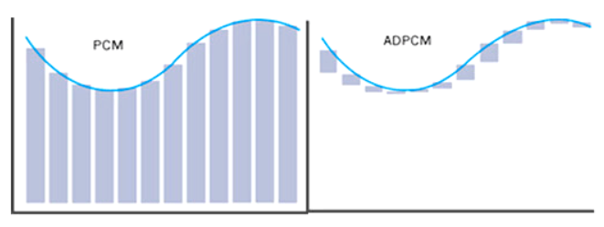

ADPCM（**Adaptive Differential Pulse Code Modulation**，自适应差分脉冲编码调制）是一种**有损音频压缩算法**，它的核心思想是在**标准的差分脉冲编码调制（DPCM）**基础上引入了**步长自适应机制**，以更好地应对音频信号的变化，达到更高的压缩率；ADPCM 是一种用于连续波形数据的有损压缩算法，它通过保存相邻波形的变化情况来描述整个波形，从而达到数据压缩的目的。

**PCM（Pulse Code Modulation，脉冲编码调制）**
PCM 是指将模拟信号抽样、量化、编码变成二进制码元的基本过程，是最常用的语言信号编码技术。
音频数据是连续的模拟型号，通过 PCM 直接将其编码成数值；比如 16-bit PCM 每个采样点占 2 字节，所以一般我们也说 PCM 是最基本的音频数字编码方式。
PCM 实际上就是一个大数组, 数组中每个值, 代表了当前时间点上的模拟量强度, 在播放时在对应的时间点上被转换为模拟量输出(DAC)。

**DPCM（差分 PCM）**
PCM 保存的是最原始的模数转换结果, 是不压缩的, 数据量比较大, 存储和通讯都会占用很大资源, 需要将数据压缩以减少通信带宽和存储的资源消耗。
DPCM 不再存储每个绝对采样值，而是存储当前采样值和前一个采样值的“差值”。优点是差值的变化通常更小，可以用更少的位数表示（比如用 4 或 8 位）。

将音频 PCM 的数组展开观察可以看到，数据值与相邻的值通常是比较连续的， 不会突然很高或者突然很低， 两点之间差值不会太大,，所以这个差值可以用很少的几个位(比如 4bit)表示。这样只需要知道起始点的值和每个点的差值，就可以还原得到原来的序列。记录的差值序列就是DPCM数据。这样数据量会小很多。
以 8K 采样率为例，如果量化精度为 16bit，则 1 秒的数据量为 8000 * 16bit = 128kb, 如果用 4bit 的表示差值, 则 1 秒的 PCM 数据转成 DPCM 只需要约 32kb。

**ADPCM（自适应差分 PCM）**
DPCM 存在一个问题，音频信号虽然比较连续性，但是存在差值较大的情况，例如差值超过 4bit 表示的范围(-15, 15) 就无法很好还原原来的 PCM 序列，这时候如果增大差值宽度，例如用 6bit，8bit 表示，可以减小这个问题，但数据量也增大了。
ADPCM 的出发点就是解决 DPCM 的差值宽度问题，通过定义一个差值表(例如 IMA ADPCM 中使用 89个固定差值，取值从7到32767)，将差值的范围放宽到 16bit，此时差值在数组中的编号只需要 6bit 就可以表示(0 - 88)，再进一步只记录编号的变化值，就将变化量压缩到了 4bit。
在 DPCM 基础上，ADPCM 加入了**步长（step size）自适应调整**机制，来根据信号波动调整编码的精度，提升压缩效率和音质。

**核心特点**：

1. **差分编码**：编码的是当前样本与预测样本之间的差值（而非原始样本值），减少数据冗余。
2. **自适应步长**：根据信号变化动态调整量化步长，以适应音频信号的动态范围。
3. **低计算复杂度**：适合资源受限的嵌入式系统。
4. **固定压缩率**：每个样本编码为 4 位，易于硬件实现。

## IMA ADPCM

**IMA ADPCM（Interactive Multimedia Association Adaptive Differential PCM）** 是一种由 IMA 协会提出的标准化的 ADPCM 算法，它每个采样点使用 **4 位（4-bit）** 数据来表示压缩后的差值（delta）。

**IMA ADPCM 编码格式**
IMA ADPCM 是把**原始的 16bit PCM 数据压缩成 4bit 的编码值**。在 C 语言里，**没有办法单独定义“4-bit”变量**。最小单位是 8bit（1个字节），所以我们用 uint8_t 来存储两个 4-bit 的 ADPCM 编码值。

对于IMA ADPCM, 还需要了解两个码表, 一个是**差值步长码表**, 一个是**差值步长下标变化量码表**

- 差值步长码表: 下标从 0 到 88，共 89 个值，从小到大，非均匀分布，下标越大，值之间的间隔越大。
- 差值步长下标变化量码表: 下标从 -7 到 7, ADPCM 队列中每个值可以通过这个直接查表得到下一个值的差值步长的下标变化量, 进而得到下一个值的差值步长。 值在 [-3, 3] 之间的, 变化都是 -1, 也就是差值步长变小, 在 [-4,-7] 和 [4,7] 的, 变化是 2, 4, 6, 8 可以看到对于 -7 和 7, 差值步长会快速增大。

```c
static int ADPCM_stepsizeTable[89] = { // 差值步长码表
    7, 8, 9, 10, 11, 12, 13, 14, 16, 17,
    19, 21, 23, 25, 28, 31, 34, 37, 41, 45,
    50, 55, 60, 66, 73, 80, 88, 97, 107, 118,
    130, 143, 157, 173, 190, 209, 230, 253, 279, 307,
    337, 371, 408, 449, 494, 544, 598, 658, 724, 796,
    876, 963, 1060, 1166, 1282, 1411, 1552, 1707, 1878, 2066,
    2272, 2499, 2749, 3024, 3327, 3660, 4026, 4428, 4871, 5358,
    5894, 6484, 7132, 7845, 8630, 9493, 10442, 11487, 12635, 13899,
    15289, 16818, 18500, 20350, 22385, 24623, 27086, 29794, 32767
};

static int ADCPCM_indexTable[16] = { // 差值步长下表变化量码表
    -1, -1, -1, -1, 2, 4, 6, 8,
    -1, -1, -1, -1, 2, 4, 6, 8,
};
```

**IMA ADPCM 格式说明**
例如一个 IMA ADPCM 编码值为 0x05, 对应二进制 0101, 其中最高位为 0, 代表变化为正, 输出值是在前一个值上叠加； 低三位为 5, 代表差值步长下标变化量为 +4(对应 ADCPCM_indexTable[5])，也就是差值步长变大了, 另外三位的每一位分别代表对应实际差值的差值步长的倍数, 参与了差值的计算。

| bit位 | 值   | 含义                                                         |
| ----- | ---- | ------------------------------------------------------------ |
| 4     | 0    | 最高位（Sign Bit）：表示差值正负（0 = 正，1 = 负）。         |
| 3     | 1    | 低三位（Magnitude Bits）：表示量化级别，权重 4，贡献 1 倍步长，调整索引。 |
| 2     | 0    | 权重 2，贡献 0.5 倍步长，参与差值计算和索引调整。            |
| 1     | 1    | 权重 1，贡献 0.25 倍步长，参与差值计算和索引调整。           |

上会产生 1 + 0 + 0.25 = 1.25 倍的差值步长，加上固定的 1/8 步长, 就是说这一步产生的输出 = 前一步数值 + 当前差值步长 * 1.375，这个值会作为下一步的数值，同时下一步的差值步长下标 +4，也就是下一个值的计算中用到的差值步长增大了。

## 编码

```c
// IMA ADPCM 编码器：将 16 位 PCM 音频压缩为 4 位 ADPCM，压缩比 4:1
// 用途：减少音频数据量，适合嵌入式系统（如 LN882H）传输语音（16kHz，64kbps）
// 算法原理：
// 1. 计算当前样本与预测值的差值（差分编码）。
// 2. 将差值量化为 4 位（3 位幅度 + 1 位符号）。
// 3. 自适应调整量化步长（基于 stepsizeTable 和 indexTable）。
// 4. 每两个 4 位样本打包为 1 字节，写入输出缓冲区。
// 5. 更新预测值和步长索引，保持连续性。
// 输入：16 位 PCM 样本（indata），长度为 len
// 输出：4 位 ADPCM 数据（outdata），每字节存 2 个样本
// 状态：adpcm_state 存储上一次的预测值和步长索引
void adpcm_coder(short *input_samples, signed char *output_adpcm, int sample_count, struct adpcm_state *state) {
    // 指针：输入 PCM 样本和输出 ADPCM 数据
    short *input_ptr = input_samples;
    signed char *output_ptr = output_adpcm;

    // 从状态恢复：上一次预测值和步长索引
    int predicted_sample = state->valprev;    // 上次预测值（16 位 PCM）
    int step_index = state->index;           // 步长表索引（0-88）
    int step_size = stepsizeTable[step_index]; // 当前量化步长

    // 打包控制：每两个 4 位样本组成 1 字节
    int temp_adpcm_value = 0;                // 临时存储 4 位 ADPCM 值
    int is_first_nibble = 1;                 // 1: 存低 4 位，0: 存高 4 位并写入

    // 处理每个输入样本
    while (sample_count > 0) {
        // 获取当前 PCM 样本（16 位，-32768 到 32767）
        int current_sample = *input_ptr++; // 这里是因为 input_samples 传递的是一个存储 PCM 数据的数组
        sample_count--; // 长度减一

        // 步骤 1：计算差值（当前样本与预测值的差值）
        int difference = current_sample - predicted_sample;
        int sign_bit = (difference < 0) ? 8 : 0; // 符号位：8=负，0=正
        if (sign_bit) {
            difference = -difference; // 取绝对值便于量化
        }

        // 步骤 2：量化和步长调整
        // 将差值量化为 4 位 ADPCM 值（0-7 幅度 + 符号位）
        int adpcm_code = 0;                      // 4 位 ADPCM 输出（0-15）
        int prediction_adjust = step_size >> 3;  // 预测值调整量（step/8）

        // 分级量化：比较差值与步长，确定幅度（0-7）
        if (difference >= step_size) { // 检查 difference 是否大于等于当前步长 step_size
            adpcm_code = 4;	// Bit 2 = 1
            difference -= step_size;
            prediction_adjust += step_size; // 累加预测值的调整量
        }
        step_size >>= 1; // 步长减半
        if (difference >= step_size) {
            adpcm_code |= 2; // Bit 1 = 1
            difference -= step_size;
            prediction_adjust += step_size;
        }
        step_size >>= 1; // 再次减半
        if (difference >= step_size) {
            adpcm_code |= 1; // Bit 0 = 1
            prediction_adjust += step_size; 
        }

        // 步骤 3：更新预测值
        // 根据符号调整预测值（正加负减）
        if (sign_bit) {
            predicted_sample -= prediction_adjust;
        } else {
            predicted_sample += prediction_adjust;
        }

        // 步骤 4：限幅预测值（16 位 PCM 范围）
        if (predicted_sample > 32767) {
            predicted_sample = 32767;
        } else if (predicted_sample < -32768) {
            predicted_sample = -32768;
        }

        // 步骤 5：合并符号位，更新步长索引
        adpcm_code |= sign_bit; // 添加符号位（0 或 8）
        step_index += indexTable[adpcm_code]; // 更新索引（基于标准表）
        if (step_index < 0) {
            step_index = 0; // 限制索引范围
        } else if (step_index > 88) {
            step_index = 88;
        }
        step_size = stepsizeTable[step_index]; // 获取新步长

        // 步骤 6：输出 4 位 ADPCM 数据
        // 两个 4 位样本打包为 1 字节（低 4 位 + 高 4 位）
        if (is_first_nibble) {
            temp_adpcm_value = adpcm_code & 0x0f; // 存低 4 位
        } else {
            *output_ptr++ = ((adpcm_code << 4) & 0xf0) | temp_adpcm_value; // 合并高低 4 位
        }
        is_first_nibble = !is_first_nibble; // 切换高/低 4 位
    }

    // 步骤 7：输出剩余的 4 位数据（若有）
    if (!is_first_nibble) {
        *output_ptr++ = temp_adpcm_value; // 写入最后一个低 4 位
    }

    // 步骤 8：保存状态以供下一帧使用
    state->valprev = predicted_sample;
    state->index = step_index;
}

struct adpcm_state {
    int valprev;
    int index;
};
```

## 解码

解码就是将 ADPCM 数组中的每个 4bit 数值，还原回编码过程中的每个 presample 值，

```c
// IMA ADPCM 解码器：将 4 位 ADPCM 音频解码为 16 位 PCM，压缩比 4:1
// 用途：将压缩的 ADPCM 数据（64kbps）解码为 PCM（256kbps），用于 LN882H 系统输出到 MAX98357A 功放
// 算法原理：
// 1. 从输入缓冲区解包 4 位 ADPCM 数据（每字节含 2 个样本）。
// 2. 分离符号位和幅度，计算预测值调整量。
// 3. 自适应更新量化步长（基于 stepsizeTable 和 indexTable）。
// 4. 根据符号调整预测值，重构 16 位 PCM 样本。
// 5. 保存状态以支持连续解码。
// 输入：4 位 ADPCM 数据（indata），长度为 len（PCM 样本数）
// 输出：16 位 PCM 样本（outdata）
// 状态：adpcm_state 存储上一次的预测值和步长索引
void adpcm_decoder(signed char *input_adpcm, short *output_samples, int sample_count, struct adpcm_state *state) {
    // 指针：输入 ADPCM 数据和输出 PCM 样本
    signed char *input_adpcm_ptr = input_adpcm;
    short *output_pcm_ptr = output_samples;

    // 从状态恢复：上一次预测值和步长索引
    int predicted_sample = state->valprev;    // 上次预测值（16 位 PCM）
    int step_index = state->index;           // 步长表索引（0-88）
    int step_size = stepsizeTable[step_index]; // 当前量化步长

    // 解包控制：每字节含两个 4 位样本（高 4 位和低 4 位）
    int temp_adpcm_value = 0;                // 临时存储 4 位 ADPCM 值
    int is_second_nibble = 0;                // 0: 读低 4 位，1: 读高 4 位

    // 处理每个输出 PCM 样本
    while (sample_count > 0) {
        // 步骤 1：解包 4 位 ADPCM 数据
        int adpcm_code;
        if (!is_second_nibble) {
            temp_adpcm_value = *input_adpcm_ptr++; // 读取新字节（含 2 个样本）
            adpcm_code = temp_adpcm_value & 0x0f;  // 提取低 4 位
        } else {
            adpcm_code = (temp_adpcm_value >> 4) & 0x0f; // 提取高 4 位
        }
        is_second_nibble = !is_second_nibble; // 切换高/低 4 位
        sample_count--;

        // 步骤 2：更新步长索引
        step_index += indexTable[adpcm_code]; // 调整索引（基于标准表）
        if (step_index < 0) {
            step_index = 0; // 限制索引范围
        } else if (step_index > 88) {
            step_index = 88;
        }

        // 步骤 3：分离符号位和幅度
        int sign_bit = adpcm_code & 8;       // 符号位：8=负，0=正
        int magnitude = adpcm_code & 7;      // 幅度：0-7

        // 步骤 4：计算预测值调整量
        // 近似公式：prediction_adjust = (magnitude + 0.5) * step_size / 4
        int prediction_adjust = step_size >> 3; // 初始调整量（step/8）
        if (magnitude & 4) {
            prediction_adjust += step_size;     // 贡献 step_size
        }
        if (magnitude & 2) {
            prediction_adjust += step_size >> 1; // 贡献 step_size/2
        }
        if (magnitude & 1) {
            prediction_adjust += step_size >> 2; // 贡献 step_size/4
        }

        // 步骤 5：更新预测值
        if (sign_bit) {
            predicted_sample -= prediction_adjust; // 负：减去调整量
        } else {
            predicted_sample += prediction_adjust; // 正：加上调整量
        }

        // 步骤 6：限幅预测值（16 位 PCM 范围）
        if (predicted_sample > 32767) {
            predicted_sample = 32767;
        } else if (predicted_sample < -32768) {
            predicted_sample = -32768;
        }

        // 步骤 7：更新步长
        step_size = stepsizeTable[step_index]; // 获取新步长

        // 步骤 8：输出解码的 PCM 样本
        *output_pcm_ptr++ = predicted_sample;
    }

    // 步骤 9：保存状态以供下一帧使用
    state->valprev = predicted_sample;
    state->index = step_index;
}

struct adpcm_state {
    int valprev;
    int index;
};
```
