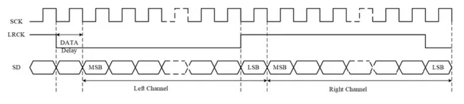
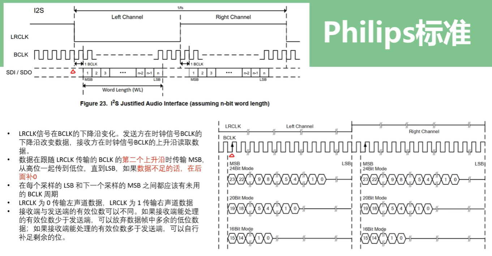
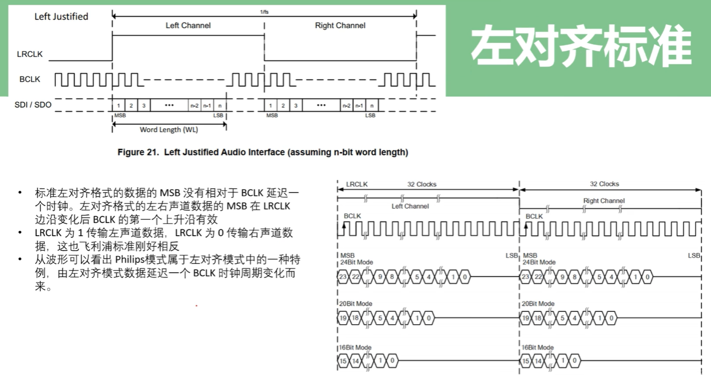
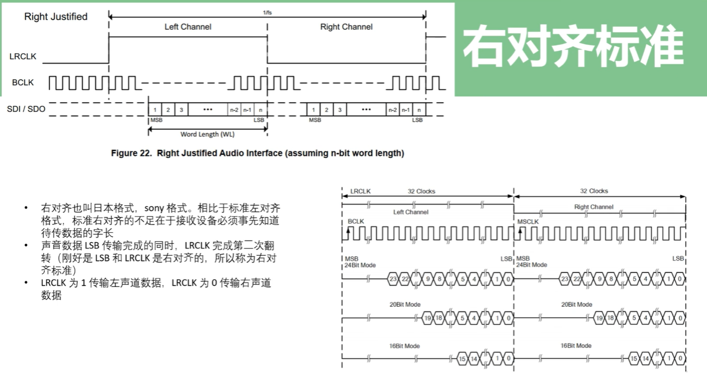
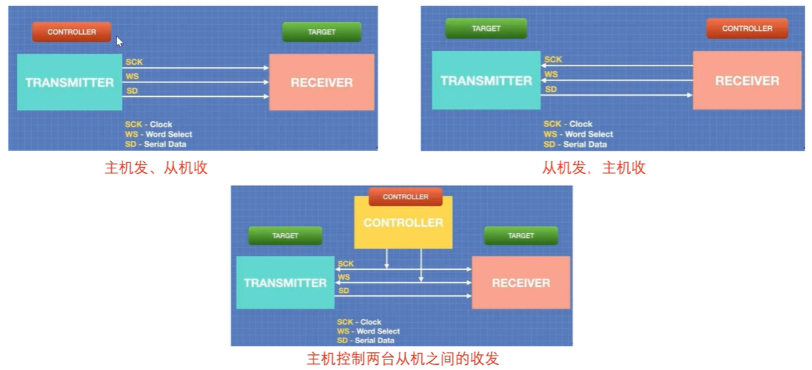

12S(Inter-lc Sound)总线,又称**集成电路内置音频总线**，是飞利浦公司为数字音频设备之间的音频数据传输而制定的一种总线标准，该总线专门用于音频设备之间的数据传输(数字信号)。
12S 是一种**串行数字音频接口**，数据是一位一位传输的，它传输的是 PCM 或 PDM 音频数据(都是未经压缩的音频采样数据裸流)。
12S 和 I2C 没有任何的关系。
I2S 特点：支持全双工 / 半双工，支持主 / 从模式。

**PCM 参数**

声道数、采样位数和采样频率
**采样频率**：每秒钟对声音样本采样的次数。采样频率越高，声音质量越好，但产生的数据量也越大。(常用 44kHz)
**采样位数**：每个采样的样本用多少位二进制表示数据。量化位数越多，音质越好，越细腻，数据量也越大。(常用 16 bit)
**声道数**：使用声音通道的个数，有单声道和立体声之分立体声比单声道数据量翻倍。
音频数据量 = 采样频率 x 量化位数 x 声道数 (bps)

## I2S基本信号线

12S总线至少有三条线，分别是

**SCK**：(continuous serial clock)串行时钟，也叫做 BCK、BCLK (位时钟)，一个时钟传输 1bit 的数据。SCK 的频率 = 声道数 x 采样频率 x 采样位数。
**WS**：(word select)字段(声道)选择，也叫 LRCK、LRCLK (帧时钟)，用于切换左右声道的数据。**WS 的频率等于采样频率**。声道选择线表明了正在被传输的声道。 **WS 为"0"表示正在传输的是左声道的数据，"1”表示正在传输的是右声道的数据**。WS 可以在**串行时钟的上升沿或者下降沿发生改变**，并且 **WS 信号不需要一定是对称的**。**在从属设备端，WS 在时钟信号的上升沿发生改变。WS 总是在最高位传输前的一个时钟周期发生改变，这样可以使从属设备得到与被传输的串行数据同步的时间，并且使接收端存储当前的命令以及为下次的命令清除空间**。
**SD**：(serial data)串行数据，用二进制补码表示的音频数据。12S 串行数据在传输的时候，**由高位(MSB)到低位(LSB)依次进行传输**。
**SCK 和 WS 信号都是由主机发送的**

## 传输标准

I2S 规定了 三种数据格式

### 飞利浦标准

**I2S Philips 标准** 使用 **LRCLK** 切换左右声道，**BCLK** 控制数据传输，数据为 **MSB 优先**，并支持不同的位宽格式。
高位数据是我们有效的数据，相对来说地位数据只是精度的差别。

### 左对齐标准

**左对齐标准** 与 Philips 标准的主要区别在于 **数据对齐方式**：

- **左对齐：MSB 在 LRCLK 变化后紧接着 BCLK 第一个上升沿传输**。
- **Philips：MSB 在 LRCLK 变化后延迟 1 个 BCLK 传输**。
- **LRCLK 信号的高低电平代表的声道也与 Philips 相反**。

### 右对齐标准

**右对齐标准（Sony 格式）** 的核心特性是 **LSB 对齐 LRCLK**，这与左对齐标准（MSB 紧跟 LRCLK 变化）不同。

- **优点**：适用于某些需要 LSB 对齐的数据处理场景。
- **缺点**：接收端必须提前知道数据字长，否则会导致数据错位。

适用于 **特定 DSP 或音频处理设备**，不同设备需要匹配对应的传输格式。

## I2S 传输模型

## LN882H I2S 支持

只支持从机模式
全双工模式双声道立体声
可配置的数据位宽，支持 12、16、20、24 和 32 位宽的数据 
支持飞利浦 I2S 标准
I2S 不支持 DMA
I2S 只有一路
因为 I2S 只支持从机模式，所以 I2S 时钟由主机提供
测试 I2S 的时候一定要注意先开主机再开从机，否则初始化从机的时候，主机可能会误收数据
I2S 作为从机接收的时候，可能会丢掉帧头帧尾的数据，发送数据的时候不会有这个问题

> **I2S 的从机模式（Slave Mode）** 指的是 I2S 设备不生成时钟信号，而是依赖外部设备（通常是主机）提供时钟信号（SCK 和 WS），并根据这些时钟信号进行数据的接收或发送。
