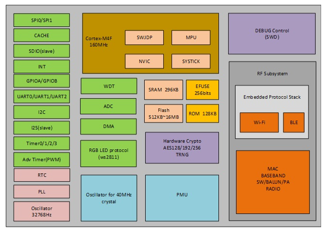

**LN882H** 是[上海亮牛半导体](http://www.lightningsemi.com/ln882h)推出的一款高集成度，支持低功耗的 Wi-Fi/BLE 双模 SoC，面向室内物联网通信场景，集成 Cortex-M4F 高性能内核、丰富外设、硬件安全模块与协议栈，适用于智能家居、传感器、可穿戴等领域。
 

**该芯片的主要特性如下**

处理器与存储资源

- **内核**：ARM Cortex‑M4F，主频高达 **160 MHz**，**支持浮点运算**。
- **RAM**：内置 **296 KB SRAM**，Wi-Fi/BLE 满载时仍保留约 **130 KB 可用内存** 供用户应用使用。
- **Flash**：支持 **8Mb / 16Mb（1MB / 2MB）** 内置 Flash（部分方案支持最大 16MB），**支持 XiP 执行**。
- **ROM/EFUSE**：内建 BootROM（128KB），EFUSE（256bit）用于芯片 ID 与安全密钥存储。

无线连接能力

- **通信协议**：支持 **802.11b/g/n** Wi‑Fi 与 **蓝牙 5.1（BLE）双模共存**。
- **集成协议栈**：内部固化 Wi‑Fi 与 BLE 协议栈，用户无需移植。
- **射频性能**：集成 MAC、基带、Balun、PA、Radio，简化外围设计。

外设接口丰富

- 多达 **20 个 GPIO 引脚**
- 常用外设包括：
  - **UART（3路）**、**SPI（2路）**、**I2C**、**I2S（Slave 模式）**、**ADC**、**PWM / Adv Timer**、**SDIO（Slave 模式）**、**RGB LED 控制协议（支持 ws2811）**。
- **DMA、RTC、看门狗、Cache、低功耗时钟振荡器** 等支持完善。

安全与可靠性

- **硬件加密**：支持 **AES-128/192/256**，含 **TRNG 真随机数生成器**。
- **EFUSE** 支持写入密钥、芯片唯一标识。
- **抗干扰能力强**：
  - **静电防护达 2000V**。
  - **支持工作温度 -40℃ ~ +105℃**。
  - **通过双85（85℃/85%RH）可靠性测试**。

封装与开发支持

- **封装规格**：**QFN32 (5mm x 5mm)**，紧凑适用于小尺寸设计。
- **开发支持**：
  - 官方 SDK，支持 Keil / GCC / CMake 等开发环境。
  - 提供 GUI 烧录工具，支持串口下载。
  - 第三方社区支持：LibreTiny、OpenBeken 等。
  - 支持 OTA 升级、安全启动等高级功能。

> **XiP（eXecute in Place）** 是一种嵌入式系统中常见的技术，它允许**CPU 直接从外部 Flash 中执行程序代码**，而**不需要先将代码拷贝到内部 RAM**。
> 正常流程：[外部 Flash] → 把程序复制 → [RAM 中运行]；XiP：[外部 Flash] → 直接执行代码，不拷贝到 RAM。
>
> **BootROM（128KB）** 是芯片内部出厂时就烧录好的程序，用于**上电后初始化芯片**、**引导主程序启动**、**支持下载模式**等，他就像是芯片的"启动 BIOS"。LN882H 由 BootROM 配置为 SWD 模式。
>
> **EFUSE（Electronic Fuse）** 是一种**一次性可编程的只写存储区域**，通常只有几十或几百 bit，在 LN882H 中是 **256bit（=32 字节）**。EFUSE 写入之后 **不可更改、不可擦除**，因此非常适合用作安全防护（如防篡改/加密验证）。
