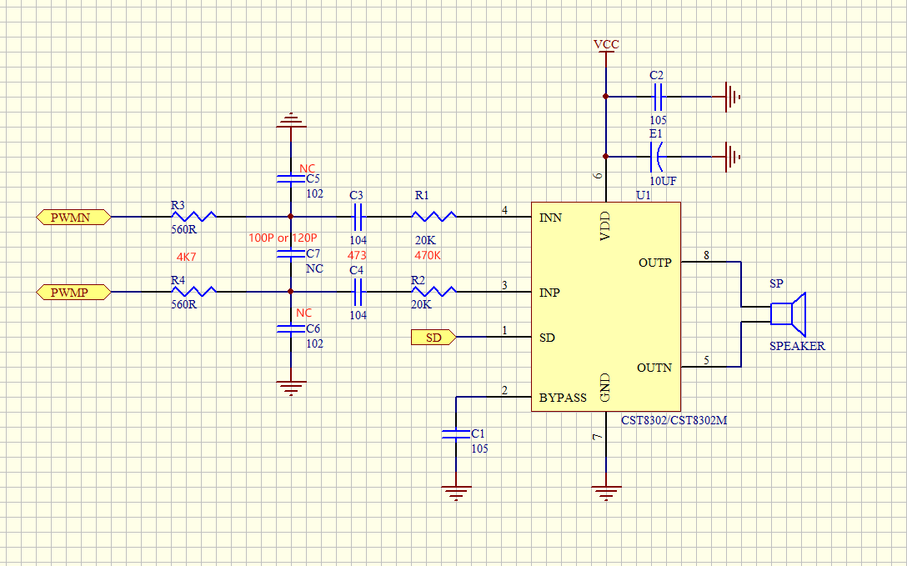
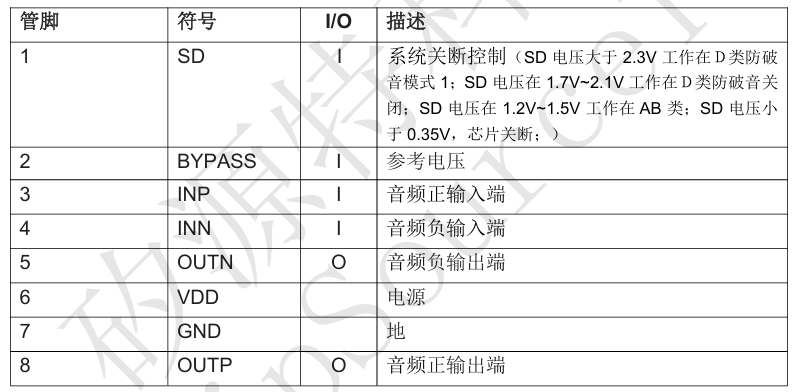
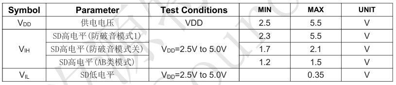

PWM（Pulse Width Modulation，脉冲宽度调制）是一种**通过调节脉冲信号的占空比（Duty Cycle）来控制功率输出**的技术。它广泛应用于 **电机控制、LED 调光、音频信号处理**等领域。

**PWM 的核心参数：**
**频率（Frequency）**：PWM 信号的重复速率(**1秒内重复的次数**)，单位 Hz。
**占空比（Duty Cycle）**：高电平时间与整个周期的比例，影响输出功率。
**周期（Period）**：PWM 信号的一个完整波形所占用的时间。

**PWM 的输出比较功能**
PWM 的 **输出比较功能（Output Compare，简称 OC）** 是基于定时器的，可以用于**控制 PWM 信号的高低电平转换**。其核心机制如下：
**定时器**计数到设定值（比较值，Compare Value）时，改变 PWM 输出信号的状态（高电平或低电平）。
通过设置**比较寄存器（Compare Register）**，决定何时翻转输出信号，从而产生 PWM 波形。

PWM 输出比较有多种模式，常见的有：
1.**PWM 方式 1（PWM Mode 1）**
计数器从 0 增加（Up Counting）时，PWM 输出在**计数值小于比较值时输出高电平**，否则输出低电平。
**占空比 = (Compare Value) / (ARR)**(ARR 是自动重装寄存器)。
2.**PWM 方式 2（PWM Mode 2）**
计数器从 0 增加时，PWM 输出在**计数值小于比较值时输出低电平**，否则输出高电平。
**与 PWM 方式 1 相反**，适用于反相驱动。
**PWM 中心对齐模式（Center-Aligned PWM）**
计数器既增又减，使得 PWM 输出在中心点对称翻转，减少高频噪声。

**喇叭使用的主要就是 PMW 的输出比较功能。**

## LN882H对PMW支持

LN882H 提供 6 个高级定时器（Timer0 至 Timer5），每个定时器支持两个 PWM 通道（通道 a 和通道 b），因此共有 12 个 PWM 通道（PWM_CHA_0 至 PWM_CHA_11）。具体映射如下：
PWM_CHA_0 和 PWM_CHA_1 对应 ADV_TIMER_0_BASE；
PWM_CHA_2 和 PWM_CHA_3 对应 ADV_TIMER_1_BASE；
PWM_CHA_4 和 PWM_CHA_5 对应 ADV_TIMER_2_BASE；
PWM_CHA_6 和 PWM_CHA_7 对应 ADV_TIMER_3_BASE；
PWM_CHA_8 和 PWM_CHA_9 对应 ADV_TIMER_4_BASE；
PWM_CHA_10 和 PWM_CHA_11 对应 ADV_TIMER_5_BASE。

由于同一定时器下的两个通道共用相同的定时器计数器，同一定时器的两个 PWM 通道必须设置为相同的频率，但占空比可以独立配置。

在 LN882H 中 PWM 支持三种对齐方式：
ADV_TIMER_CNT_MODE_INC         是计数器向上计数，对应的 PWM 就是左对齐。
ADV_TIMER_CNT_MODE_DEC        是计数器向下计数，对应的 PWM 就是右对齐。
ADV_TIMER_CNT_MODE_BOTH     是计数器先向上计数然后向下计数，对应的 PWM 就是中间对齐，中间对齐时要注意PWM的频率左右对齐的二分之一（相同LOAD值的情况下）。

**配置 PWM 死区的时候，会自动让 PWMA 和 PWMB 形成互补，此时，如果想改变波形的占空比只能 通过改变 PWMA 的通道值，改变 PWMB 无效。**

LOAD 值设置为 65535 的时候会无法产生 LOAD 中断。

由于 PWM 中断标志位是通过 W1C ISRR 寄存器，因此无法通过写位域来清除相应标志位（因为写位域会先读再逻辑或再写，写的时候会把别的标志位也置1）。

PWM 占空比设置到 100% 的时候，波形会出现毛刺。

PWM 周期 p = (load) * 1 / (APB / DIV) s，占空比为 cmp_a / load，其中 load 为加载值，cmp_a 为比较值，APB 为外设时钟，DIV 为高级定时器的分频。

PWM 频率范围：100hz ~ 20Mhz

## 音频基本参数

想用 PWM 驱动喇叭播放声音。首先得理解音频的基本参数，比如位深、采样率等。

位深度：也就是每个样本的位数。8 位和 16 位的区别会影响动态范围，需要举例说明。比如 16 位能有更多细节，声音更细腻。

- 本质：模数转换的量化精度
- 典型值：8bit（256级）或 16bit（65536级）
- 嵌入式影响：16bit 音频需要 2 字节存储，DMA 传输时需注意字节序
- 动态范围公式：20*log10(2ⁿ) dB，16bit≈96dB

采样率：表示**每秒对模拟声音信号采样的次数**；44.1kHz 是 CD 标准，得解释为什么是这个数值，根据奈奎斯特定理，**采样率至少是最高频率的两倍**，人耳听到 20kHz，所以44.1kHz 足够。还要提到其他常见采样率，比如 8kHz 用于电话，48kHz 用于视频。

- 奈奎斯特上限：22.05kHz（人类听觉极限20kHz）
- 嵌入式实现方案：
  - 8kHz（电话级）：定时器中断周期125μs
  - 44.1kHz：需要精确的时钟源（如STM32的I2S PLL）
  - PWM载波频率 ≥ 10×采样率（避免谐波干扰）

简单来说就是一秒内采样 44.1K 次(即每秒钟有 44,100 个样本)，每次存储的精度为 16 bit。

## 电路设计

单独的喇叭声音太小了，无法播放满足我们需求的声音，所以这里需要外接一个功率放大器(AXS2035)，下面是 AXS2035 官方提供的一个通过 PWM 进行音频信号传输的一个示例电路。 


### AXS2035

**引脚说明**


**推荐工作模式**


> 注意如用要使用 PWM 输出声音信号，我们需要注意他是差分功放还是单端功放
>
> 单端功放的输入和输出都**相对于地（GND）**，这就意味着：
>
> - 信号电压上下波动，例如从 -1V 到 +1V；
> - 功放会将这个信号放大，比如输出从 -5V 到 +5V；
> - 功放的输出端就是正负交替的电压波形，它推动扬声器的线圈前后运动，从而模拟空气中的“推动”和“拉回”——即正负声音变化。
>
> 差分功放输出的是两路信号，叫做 **+OUT** 和 **–OUT**，两者始终是**对称的**：
>
> - 当 +OUT = +1V 时，–OUT = -1V；
>
> - 当 +OUT = -2V 时，–OUT = +2V；
>
> - 所以扬声器两端看到的是：
>   $$
>   V_{\text{diff}} = +OUT - (-OUT) = 2 \times \text{输入信号}
>   $$
>
> - 这就叫做**差分信号**，它的好处是：
>
>   - 输出摆幅是单端的 **2 倍**，声音更响；
>
>   - 不依赖地线，抗干扰性强；
>
>   - 音频设备中常用于“平衡输出”。

## 实现原理

利用 PWM 实现喇叭播放的效果，本质上就是通过 PWM 模拟 DAC 的过程；也就是通过一组互补的 PWM + 外围的滤波电路，实现 DAC 播放的功能。

**差分PWM**

差分 PWM 的本质，就是两个相位相反的 PWM 信号；要注意：
1.使用互补输出的定时器通道
2.设置死区时间防止直通

PWM 参数
PWM 频率：PWM 的频率通常指**载波频率**，而采样率是音频数据的**更新频率**。
根据奈奎斯特定理，为了减少谐波失真，载波频率通常需要远高于音频的最高频率，比如 (4 -10) 倍以上。但具体数值还要看硬件能否支持，比如微控制器的定时器是否能生成足够高的频率。
**简单说明：载波频率就是我们设置的 PWM 频率，更新频率就是指音频数据更新的频率**

PWM 占空比对应声音的幅度：PWM 的频率是固定的，表示的是“采样率”；PWM 的占空比变化，代表了“声音波形”，也就是 PCM 的“幅度”变化——这才是声音的内容。

> 占空比决定瞬时电压幅度（对应音量，但需非线性映射）
> PCM 值映射到占空比，PCM 越大（正向或负向），PWM 的差值（PWM+ - PWM-）越大，滤波后电压幅度越大，声音越响。
> 在差分 PWM 中：PWM+ - PWM- 的绝对值越大，声音越大。

PWM 分辨率：PWM 的分辨率由定时器的位数决定，比如 16 位定时器可以提供更高的分辨率。但更高的分辨率需要更低的PWM频率，或者更高的时钟源。需要找到一个平衡点，既满足音频质量，又不超出硬件限制。
分辨率 = 系统时钟频率 / PWM 频率。

> **分辨率（Resolution）** 是 PWM 计数器的最大值（Max_Count），决定占空比可以分成的级数。分辨率高（如 10 位，1024 级），占空比每级变化小（3.3V / 1024 ≈ 3.2mV），控制更精细。
> 分辨率低（如 6 位，64 级），每级变化大（3.3V / 64 ≈ 51.6mV），控制较粗糙。
> 动态范围是从最小幅度到最大幅度的跨度，分辨率越高，级别越多，范围内的细节更多。
> 低分辨率下，占空比跳跃大，模拟信号不够平滑，引入量化噪声（失真）。
> 分辨率决定占空比变化的“步进大小”（granularity），即控制的精细程度，分辨率不直接决定最大幅度（由电源电压决定，例如 3.3V），但影响幅度变化的“分辨能力”。高分辨率：能精确表示小幅度变化（例如 0.1V）、低分辨率：只能粗略表示（例如 0.5V 跳变）。

## 实现思路

以 44.1kHz，16 位深的 PCM 数据来说明实现思路：
44.1kHz 表示每秒采样 44100 次，也就是 22.68µs 采样一次，16 位深表示每个样本存储为一个 16 位数据（范围 -32768 到 +32767）。
我们如果想用 PWM 输出这样的 PCM 数据，就需要精确的按照 PCM 的格式每 22.68µs 读取一次，与 44.1kHz 对应。读取的长度也要一致 16 位深的，那么我们读取的时候也是要读取 16 位。

> 在配置时 PWM 要以远高于 PCM 采样率的频率（10 倍）输出脉冲，而不是与 PCM 的采样率（如 44.1kHz 或 48kHz）保持一致。
>
> 因为 PWM 是通过改变脉冲的占空比来模拟模拟信号的，但每个 PWM 周期只能输出一个占空比值，对应一个采样点。如果 PWM 频率与 PCM 采样率相同，那么每个采样点只能对应一个 PWM 周期，这样会导致输出波形不连续，产生大量高频谐波，超出喇叭的响应范围，导致失真。
>
> 另外，PWM 输出后需要通过低通滤波器恢复模拟信号，滤波器的截止频率通常是音频的最高频率（20kHz）。如果 PWM 频率不够高，谐波成分会落在音频范围内，无法被有效滤除，导致噪声和失真。比如，如果 PWM 频率是 44.1kHz，其谐波会在44.1kHz附近，但低通滤波器可能无法完全滤除，导致干扰。

**从 PCM 到 PWM 差分信号**

理论基础
PCM 数据：以固定采样率（如 44.1kHz）和位深（如 16 位）表示。每个样本是一个有符号整数，表示瞬时幅度。
PWM 信号：使用一组互补的 PWM 以差分信号的方式模拟 PCM 数据，通过改变占空比模拟幅度。
转换目标：将 PCM 的每个样本值映射到 PWM 的占空比差（PWM+ - PWM-），驱动功放。

差分 PWM 的核心
正端 PWM(PWM+)：占空比随 PCM 值正向变化。
负端 PWM(PWM-)：占空比随 PCM 值反向变化。
差值(PWM+ - PWM-)：线性对应 PCM 幅度。

PCM 格式转化
输入：假设 PCM 数据是 16 位有符号整数，范围为 -32768 到 +32767，采样率例如 44.1kHz。
归一化：将 PCM 值映射到 0 到 1 的浮点范围：Normalized = (PCM + 32768) / 65536，结果范围为 [0, 1]（单端 PWM）
差分需求：差分信号需要将幅度分为正负两部分，映射到 PWM 的占空比

设置 PWM 参数
PWM频率：应远高于音频频率（通常 20Hz-20kHz），建议 10 倍往上
分辨率：PWM 的计数器分辨率（如 10 位，0-1023）决定占空比精度。
互补输出：配置 MCU 的两个 PWM 通道为互补模式(需要硬件支持)

PCM 映射到  PWM
将 PCM 值分为正负部分：
如果 PCM ≥ 0
→PWM+ 占空比 = PCM / 32767 * Max_Count / 2 + Max_Count / 2。
→PWM- 占空比 = Max_Count / 2。
如果 PCM < 0
→PWM+ 占空比 = Max_Count / 2。
→PWM- 占空比 = Max_Count / 2 - PCM / 32768 * Max_Count / 2。
中点（PCM = 0）时，PWM+ 和 PWM- 占空比均为 50%（Max_Count / 2），差值为 0。

> Max_Count 是 PWM 定时器的最大计数值（Maximum Counter Value），决定了 PWM 的分辨率。

硬件输出
PWM通道：PWM+ 输出到功放正端输入、PWM- 输出到功放负端输入。
低通滤波：功放前加 LC 滤波器，去除 PWM 高频载波，恢复模拟音频。

典型问题排查：
蜂鸣声：检查PWM载波频率是否过低
失真：确认低通滤波器截止频率
爆音：添加淡入淡出效果
电流过大：测量喇叭阻抗匹配情况

## 代码实现

### 实现一

喇叭出声：播放生日快乐歌；
注意：音符和人声的原理是不同的

```c
#include "hal/hal_clock.h"
#include "hal/hal_common.h"
#include "hal/hal_gpio.h"
#include "ln_show_reg.h"
#include "ln_test_common.h"
#include "utils/debug/log.h"
#include "ln_drv_pwm.h"

const uint32_t melody[] = {
    523, 523, 587, 523, 698, 622,     // C5 C5 D5 C5 F5 Eb5
    523, 523, 587, 523, 784, 698,     // C5 C5 D5 C5 G5 F5
    523, 523, 1047, 830, 698, 622,    // C5 C5 C6 Ab5 F5 Eb5
    587, 587, 1047, 830, 784, 698     // D5 D5 C6 Ab5 G5 F5
};

const uint32_t duration[] = {
    250, 250, 500, 500, 500, 1000,
    250, 250, 500, 500, 500, 1000,
    250, 250, 500, 500, 500, 1000,
    250, 250, 500, 500, 500, 1000
};

#define NOTE_COUNT (sizeof(melody) / sizeof(melody[0]))

void init_pwm(void) {
    gpio_init_t_def gpio_init;
    memset(&gpio_init, 0, sizeof(gpio_init));
    gpio_init.dir = GPIO_OUTPUT;
    gpio_init.pin = GPIO_PIN_4;
    gpio_init.speed = GPIO_HIGH_SPEED;
    hal_gpio_init(GPIOB_BASE, &gpio_init);
    hal_gpio_pin_reset(GPIOB_BASE, GPIO_PIN_4); // PB4拉低，启用功放

    // 初始频率为第一个音符，启用互补PWM
    pwm_init(melody[0], 50.0, PWM_CHA_0, GPIO_B, GPIO_PIN_5);
    pwm_init(melody[0], 50.0, PWM_CHA_1, GPIO_B, GPIO_PIN_6); // 初始化CHA_1以启用互补
    pwm_start(PWM_CHA_0);
    pwm_start(PWM_CHA_1);
}

void play_happy_birthday(void) {
    for (int i = 0; i < NOTE_COUNT; i++) {
        // 停止PWM以更新频率
        pwm_stop(PWM_CHA_0);
        pwm_stop(PWM_CHA_1);

        // 只设置CHA_0的频率，CHA_1自动互补
        pwm_set_freq(PWM_CHA_0, melody[i]);
        pwm_set_duty(50.0, PWM_CHA_0); // 固定50%占空比，CHA_1自动反相

        // 重启PWM
        pwm_start(PWM_CHA_0);
        pwm_start(PWM_CHA_1);
        
        LOG(LOG_LVL_INFO, "Playing note %d: %d Hz, duration: %d ms\n", i, melody[i], duration[i]);
        
        // 添加音符间隔
        ln_delay_ms(duration[i] - 50); // 播放时长减少50ms
        pwm_set_duty(50.0, PWM_CHA_0); // 静音（占空比50%，无净输出）
        ln_delay_ms(50); // 50ms静音间隔
    }
}

int main(int argc, char *argv[]) {
    SetSysClock();
    log_init();
    LOG(LOG_LVL_INFO, "LN882H init for Happy Birthday song!\n");
    ln_show_reg_init();

    init_pwm();

    while (1) {
        LOG(LOG_LVL_INFO, "Starting Happy Birthday song...\n");
        play_happy_birthday();
        LOG(LOG_LVL_INFO, "Song finished, restarting...\n");
        ln_delay_ms(1000);
    }

    return 0;
}

```

### 实现二

实现思路：
通过 PWM 信号模拟 24 kHz、16 位 PCM 单声道音频，利用 PB5 和 PB6 输出互补波形，最终通过低通滤波器还原为模拟音频信号。核心是**用 PWM 的占空比变化模拟音频波形的幅度变化**。
定时器模拟 24k 的采样频率，PWM 模拟音频波形，PWM 分辨率是隐式的不需要单独设置。

```c
#include "ln_drv_pwm.h"
#include "ln_drv_timer.h"
#include <math.h> // 用于生成示例正弦波

// 环形缓冲区和控制变量
#define SAMPLE_RATE 24000
#define PWM_FREQ 96000  // PWM 频率                 
#define BUFFER_SIZE 4096 // 4096 个样本，约 170 ms 缓冲
static int16_t audio_buffer[BUFFER_SIZE]; // 示例音频数据
static uint32_t read_pos = 0;             // 读指针
static volatile uint8_t play_state = 0;   // 0: STOPPED, 1: PLAYING, 2: PAUSED
static float volume = 1.0;                // 音量因子 (0.0 到 1.0)

// PWM 初始化
void audio_pwm_init(void) {
    // 配置 PB5 为 PWM_CHA_0 (正相)
    pwm_init(PWM_FREQ, 50.0, PWM_CHA_0, GPIO_B, GPIO_PIN_5);
    pwm_start(PWM_CHA_0);

    // 配置 PB6 为 PWM_CHA_1 (反相)
    pwm_init(PWM_FREQ, 50.0, PWM_CHA_1, GPIO_B, GPIO_PIN_6);
    pwm_start(PWM_CHA_1);
}

// 定时器中断处理函数（24 kHz）
void audio_timer_callback(void) {
    if (play_state == 1) { // PLAYING
        int16_t sample = audio_buffer[read_pos];
        read_pos = (read_pos + 1) % BUFFER_SIZE;

        // 应用音量并映射到 PWM 占空比 (0-100%)
        float adjusted = (sample * volume / 32767.0f) * 50.0f + 50.0f; // -32768~32767 映射到 0-100%
        if (adjusted < 0.0f) adjusted = 0.0f;
        if (adjusted > 100.0f) adjusted = 100.0f;

        // 更新互补 PWM 占空比
        pwm_set_duty(adjusted, PWM_CHA_0);        // 正相
        pwm_set_duty(100.0f - adjusted, PWM_CHA_1); // 反相
    } else if (play_state == 2) { // PAUSED
        pwm_set_duty(50.0f, PWM_CHA_0);
        pwm_set_duty(50.0f, PWM_CHA_1);
    }
}

// 定时器初始化 (24 kHz)
void audio_timer_init(void) {
    uint32_t period_us = 1000000 / SAMPLE_RATE; // 定时器采样频率 41.67 us 
    timer_init(TIMER_CH_0, period_us, audio_timer_callback);
}

// 播放控制
void audio_play(void) {
    play_state = 1;
}

void audio_pause(void) {
    play_state = 2;
}

void audio_stop(void) {
    play_state = 0;
    pwm_set_duty(50.0f, PWM_CHA_0);
    pwm_set_duty(50.0f, PWM_CHA_1);
}

// 音量调节
void audio_set_volume(float vol) {
    if (vol < 0.0f) vol = 0.0f;
    if (vol > 1.0f) vol = 1.0f;
    volume = vol;
}

// 主函数
int main(void) {
    // 系统初始化（假设已有）
    // system_init();

    // 填充示例音频数据（440 Hz 正弦波）
    for (uint32_t i = 0; i < BUFFER_SIZE; i++) {
        audio_buffer[i] = (int16_t)(sinf(2 * 3.14159f * 440 * i / SAMPLE_RATE) * 32767);
    }

    // 初始化 PWM 和定时器
    audio_pwm_init();
    audio_timer_init();

    // 设置初始音量并开始播放
    audio_set_volume(0.8f); // 80% 音量
    audio_play();

    while (1) {
        // 示例控制逻辑（可替换为你的实际控制）
        // 例如通过按键或命令暂停、停止、调整音量
    }
}
```
