Image Signal Processing（ISP 图像信号处理器）是负责对光学传感器（可以记录光线信息的半导体）输出的 RAW 图数据进行信号处理，使之成为符合人眼真实生理感受的信号，并加以输出。

## RAW

在探讨 ISP Pipeline 之前，我们必须先从图像数据的 “源头” 说起 ——RAW 格式，RAW 是光学传感器捕捉光信号后生成的、未经过色彩校准、降噪等任何优化处理的**原始图像数据**，不具备直接可查看的标准图片形态。

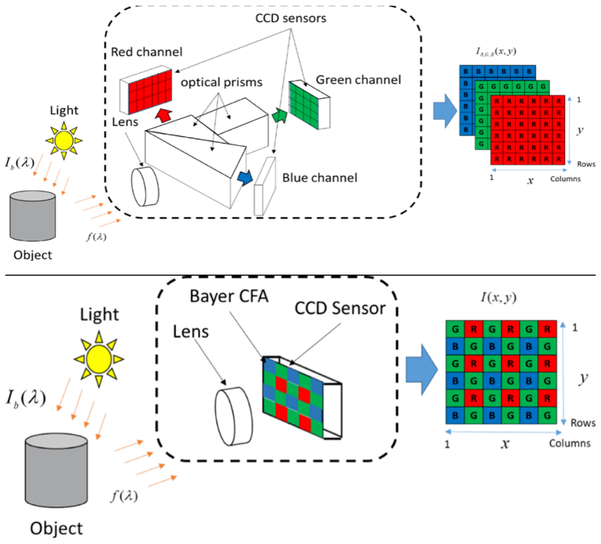

>光进来 → 用**三棱镜**把光**劈成三份**（红/绿/蓝）。
>
>**红摄影师**只拍红色，拍得清清楚楚。
>
>**绿摄影师**只拍绿色，也清清楚楚。
>
>**蓝摄影师**只拍蓝色，同样清晰。
>
>最后把三张**完整照片**拼起来 → **完美RGB图**，**没有模糊**。
>
>光进来 → 一个相机，但镜头前贴了一层彩色格子膜。
>
>光电转换：CCD传感器内部的光敏单元（光电二极管），光子 → 电子的转换都发生在CCD（或CMOS）传感器的每个像素的光敏区域。光子打在硅材料上，产生光生电子，积累成电荷。
>
>模数转换：CCD输出后，进入ADC（模数转换器），积累的模拟电荷/电压信号通过传感器内部或外部的**模数转换器（ADC）**转为数字信号。输出为数字化的像素值（如8位/12位/16位整数）。

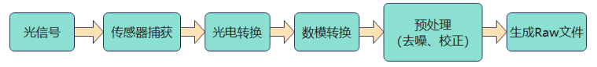

## CFA

因为 sensor 只能感受光的强度，而不能感受光的颜色，那我们平时使用的RGB色是哪里来的呢，这时候就需要彩色滤光片（Color Filter Array）登场了。

**色彩滤波阵列（CFA，Color Filter Array）**是覆盖在光学传感器（如 CMOS、CCD）感光单元表面的一层滤光膜结构，其核心作用是让每个像素只接收特定颜色的光信号，从而实现对彩色图像的原始数据采集。

目前最常用的滤镜阵列是棋盘格式的，主流色彩滤波阵列（CFA）有以下几种：

- **Bayer 阵列（最通用）**采用 “2×2” 重复单元的周期性排列，最常见的是 “RGGB” 模式（1 红、2 绿、1 蓝）。绿色像素占比更高，是因为人眼对绿色光更敏感。Bayer 阵列的优势是结构简单、算法成熟，ISP 中的 “Demosaic（色彩插值）” 步骤能高效将单通道 RAW 数据还原为 RGB 全彩色图像。

  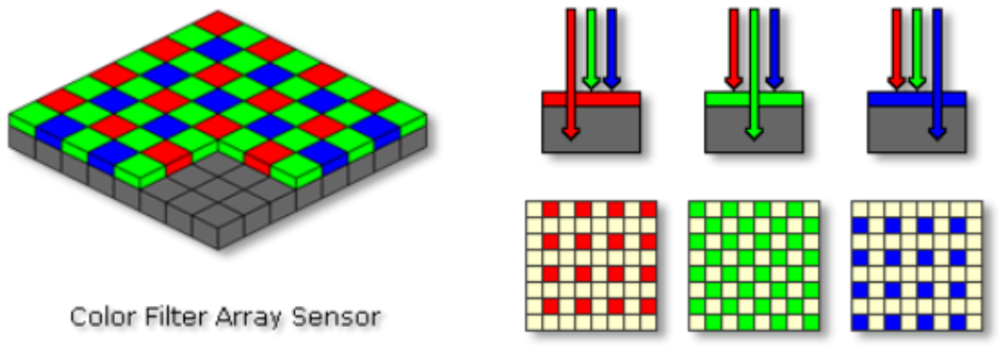

  **所有颜色的光都会到达每个像素，但滤光片只允许 “对应颜色” 的光通过，其他颜色的光会被滤掉**，而不是 “非对应颜色的像素就完全变暗”。
- **Quad Bayer 阵列（高像素 / 高动态场景）**作为 Bayer 的衍生版本，它以 “4×4” 为单元，将同色像素（如红、绿、蓝）按 2×2 分组排列。这种设计支持两种核心模式：高像素模式下输出全尺寸 RAW 数据（如 1 亿像素）；高动态范围模式下将同色 4 像素合并为 1 个，提升单像素进光量，显著降低暗光噪点。目前广泛应用于手机主摄、高端安防摄像头等场景。
- **X-Trans 阵列（富士专属，低摩尔纹）**富士自研的非周期性 6×6 阵列，通过打乱像素排列规律，减少了传统 Bayer 阵列易产生的 “摩尔纹”（图像中不必要的条纹干扰），因此无需依赖低通滤镜，能保留更多细节。其 RAW 数据格式为 .RAF，处理时需要适配专属的 Demosaic 算法，否则易出现色彩失真。

不同的 CFA 设计，决定了 RAW 数据的底层结构（如像素排列、通道占比），而 ISP Pipeline 的第一步，就是接收这些特定格式的 RAW 数据，开启从 “原始信号” 到 “可视图像” 的转化之旅。

## ISP流程

在图像传感器生成 RAW 原始数据后，需通过图像信号处理器（ISP）进行一系列专业化处理，其典型流程如下：

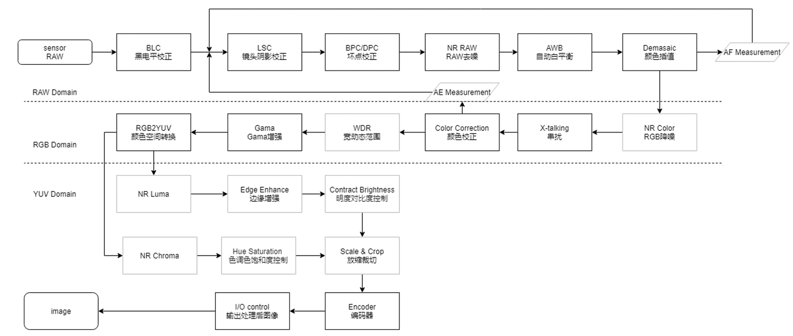

不同厂家的 ISP 处理流程在具体环节的顺序上可能存在细微差异，但整体的技术逻辑和核心处理环节是趋于一致的。

### BLC 黑电平矫正

消除图像传感器暗电流噪声、统一暗部基准，避免画面暗部偏色或出现杂点的基础预处理环节。

### DPC 坏点矫正
通过算法检测并修复图像传感器上因缺陷或异常产生的坏点（一些很突兀的颜色点，全黑全白等），避免其影响后续图像质量的关键预处理环节。

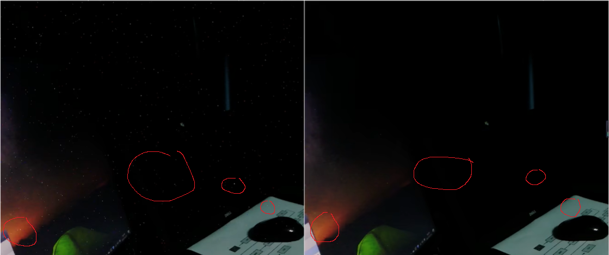

### NR 降噪

通过算法抑制图像传感器或传输过程中产生的噪声（电磁干扰等），同时尽可能保留画面细节的画质优化环节。

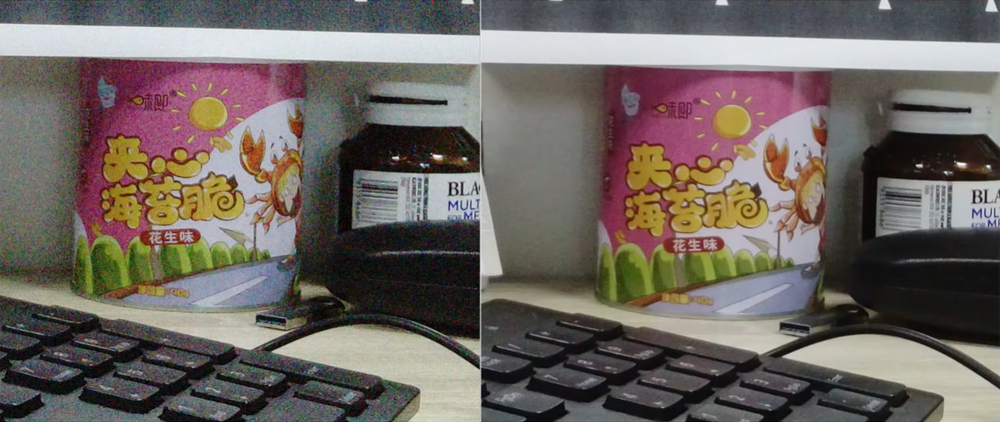

### LSC 镜头阴影矫正

通过算法补偿因镜头光学特性导致的画面边缘亮度 / 色彩衰减，使图像整体亮度和色彩分布更均匀的预处理环节。

### AWB 自动白平衡

通过检测场景光源特性，自动调整红、绿、蓝通道的增益比例（色温），消除不同色温下的色彩偏色，使白色还原准确的色彩校正环节。

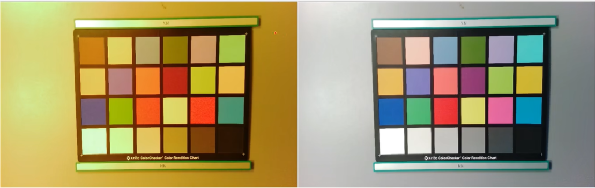

### Demosiac 去马赛克

通过算法对 Bayer 阵列滤光片采集的单通道色彩信息进行插值，还原出每个像素完整 RGB 色彩数据的关键色彩重建环节。（从 Bayer 变成 RGB）

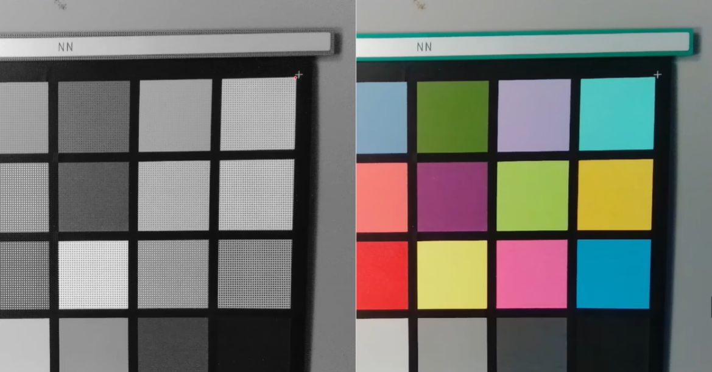

### CCM 颜色矫正

通过矩阵运算调整 RGB 三通道的比例关系，精细修正色彩偏差，使图像色彩符合标准色域或人眼感知的精准色彩校准环节。

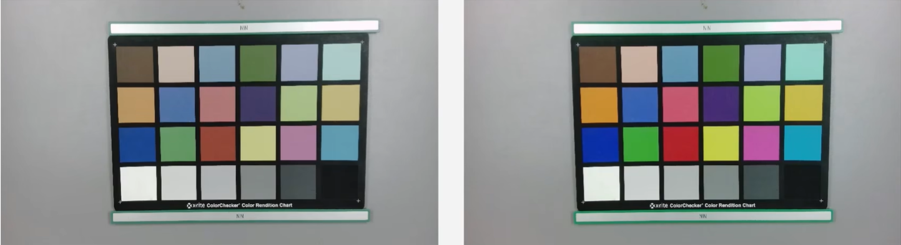

### Gamma 伽马

通过调整图像的明暗响应曲线，补偿人眼与显示设备的亮度感知差异，优化画面暗部 / 亮部细节呈现的画质调整环节。

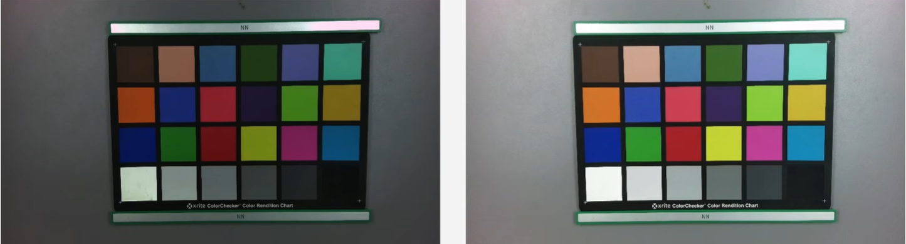

### EE 边缘增强

通过算法强化图像中物体的边缘对比度，让**画面轮廓**更清晰、细节更锐利的画质优化环节。

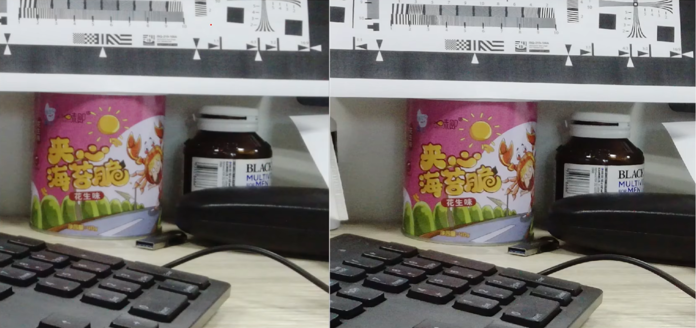

### WDR 宽动态范围

通过融合不同曝光度的图像数据，扩展画面中亮部和暗部的动态范围，避免高光过曝或暗部丢失细节的高对比度场景处理技术。

### ISP 优化效果

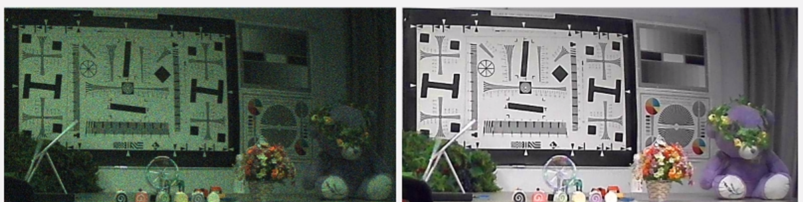

## ISP 算法流程

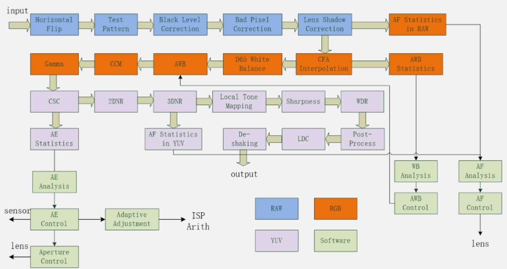
