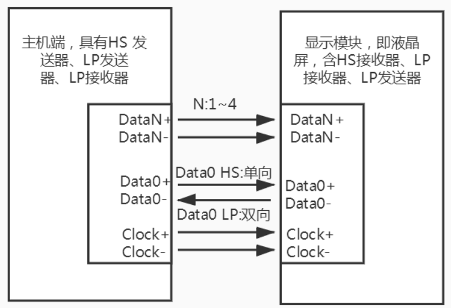
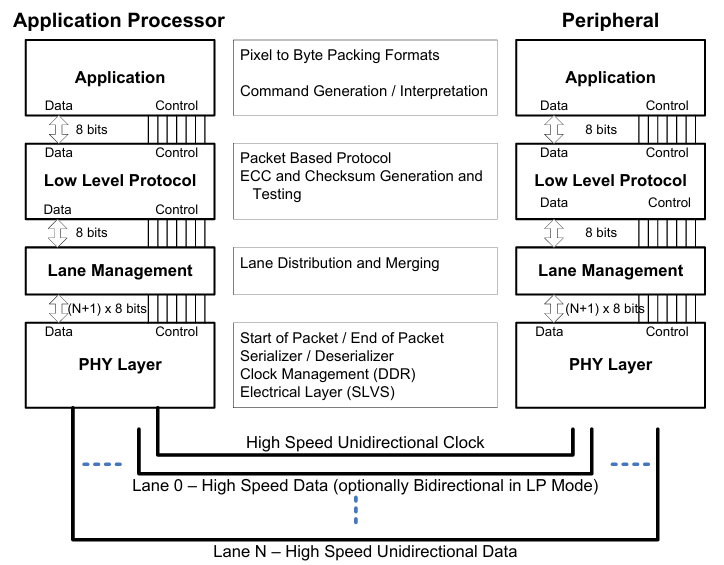
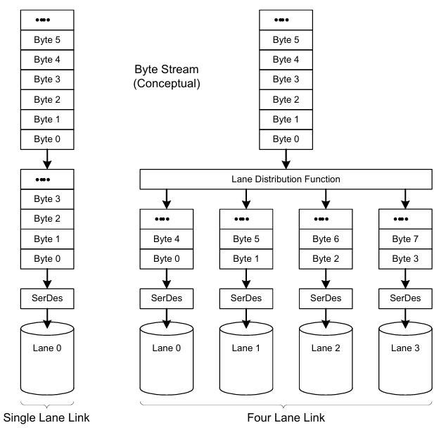
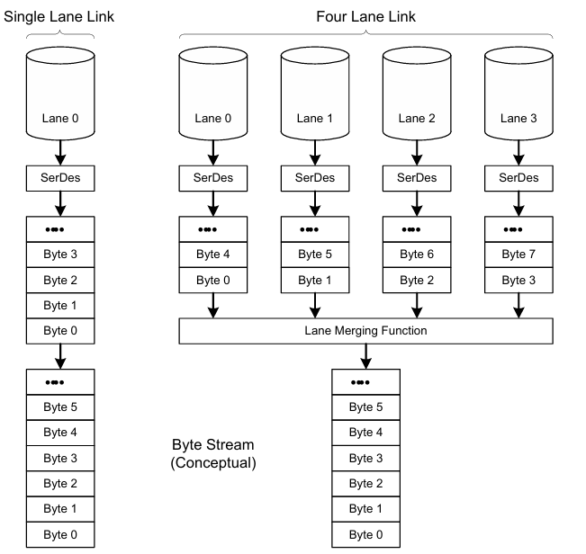

**MIPI**（**移动行业处理器接口**）是 **Mobile Industry Processor Interface** 的缩写，它是由 MIPI 联盟发起制定的、面向移动应用处理器的开放标准。而 **DSI**（显示串行接口）则是 MIPI 联盟规范中，专门用于图像显示相关数据传输的一组通信协议。

**核心思想：** MIPI DSI 驱动屏幕的本质是 CPU 或 GPU 生成的图像数据，借助由物理层、数据链路层、协议层、应用层等构成的软件协议栈，以及高速收发器、时钟管理等硬件模块的协同作用，最终以高速**串行差分信号**的形式传输到屏幕的驱动 IC 上。驱动 IC 再依据这些信号，精准控制液晶屏幕或 OLED（有机发光二极管）屏幕的像素点，从而实现图像的显示。

## 接口概述

MIPI DSI 采用差分信号传输机制，其接口包括**数据线和时钟线，均以差分形式实现**。数据线可灵活配置为1、2、3或4条通道（lanes），时钟线则固定为一对差分线。

MIPI DSI 支持串行通信，不仅能向屏幕发送控制指令和图像数据，还可从屏幕读取状态信息（前提是屏幕端支持双向传输）。屏幕显示的带宽需求与分辨率、帧率等参数密切相关：分辨率越高、帧率越快，图像数据量越大，从而对传输能力提出更高要求。此时，可通过增加数据通道数来提升带宽。

## 分层

MIPI DSI 按照工作原理从上到下可分为四层，分别是**应用层**、**协议层**、**通道管理层（数据链路层）**、**物理层**。

### 应用层

应用层负责更高层次的编码，将要显示的像素数据、控制命令（如分辨率设置、亮度调节）打包成符合 MIPI DSI 规范的协议数据单元并封装进数据流中。下层负责处理并发送这些应用层数据流。发送端根据 MIPI DSI 规格的格式，对命令和数据进行编码（如短包用于简单命令、长包用于像素数据）；接收端则解码接收到的数据流，还原为原始的像素信息和控制指令，从而驱动屏幕渲染显示。

### 协议层

协议层主要负责数据打包与封装，将应用层传递下来的原始数据（如像素信息或控制命令）组织成符合 MIPI DSI 协议的标准化数据包。在此过程中，会在原始数据包上添加错误校正码（ECC）和校验和（Checksum）等机制，以确保传输的完整性和可靠性。应用层的数据会被打包成两种主要格式：**短数据包**（Short Packet，用于简单命令或同步信息）和**长数据包**（Long Packet，用于大量像素数据）。

发送端首先将原始数据打包成指定格式，添加包头（Header，包括虚拟通道、数据类型、字数等信息）和包尾（Tail，包括校验和），然后将完整的数据包传递给下层进行实际传输。接收端从下层接收到数据包后，执行相反的操作：去除包头和包尾，使用 ECC 进行错误检测与校正，并验证校验和。如果数据无误，则解包并将还原的原始数据上交应用层，进一步处理为显示内容。

### 通道管理层

链路层负责数据在多通道间的分配与并行传输管理，确保高效利用接口资源。MIPI DSI 支持 1/2/3/4 Lane 配置，通道数量的选择取决于实际应用场景：如果带宽需求较低（如低分辨率显示），2 Lane 即可满足；对于高带宽需求（如 4K 高刷新率屏幕），则需采用 4 Lane 以提升整体吞吐量。

协议层（或传输层）传递下来的数据包均为串行格式。如果采用 1 Lane 配置，则直接使用该单通道将数据串行发送出去，无需额外分配；对于 2/4 Lane 配置，数据需通过并行拆分机制进行分配，以充分利用多通道的带宽。具体而言，发送端将串行数据包拆分成多个子流，按字（word）或字节（byte）单元均匀分布到各 Lane 上，同时同步时钟信号确保各通道数据对齐。接收端则同步重组这些子流，还原为完整的串行数据包。 

**链路层多通道传输同步机制**

在多 Lane 配置下，链路层需处理数据包的传输结束同步，以确保接收端正确重组数据。这种同步机制主要分为两种传输模式，取决于数据包长度与通道数的匹配关系。

- **整数倍传输模式**：当数据包长度为通道数的整数倍时（如 2 Lane 配置下总字节数为偶数），所有通道（如 Lane 0 和 Lane 1）的数据分配均匀，因此同时传输完毕，一起进入 EoT（End of Transmission）模式，并发送停止信号以保持整体同步。这种方式简化了时序管理，避免了通道间的不一致。

- **非整数倍传输模式**：当数据包长度不是通道数的整数倍时，通道传输结束时间不均匀，导致部分通道提前完成。例如，在 2 Lane 配置中，Lane 1 先传输完其分配数据，因此 Lane 1 提前进入 EoT 模式并保持空闲状态，而 Lane 0 继续传输剩余数据，直至所有通道均完成；同理，在 3/4 Lane 配置下，也会出现部分通道先结束的情况。这种机制通过插入空闲周期（idle periods）或填充字节，避免数据丢失或错位，确保传输的完整性。

在接收端，则执行相反的操作：各 Lane 同步检测 EoT 信号，等待所有通道完成传输后，将分散在各 Lane 上的数据流按顺序重组、打包成完整的串行数据包，并上报给上层（如传输层）进一步处理。这种对称设计保证了端到端的可靠性和数据一致性，即使在复杂多通道场景中也能高效工作。

### 物理层

物理层是 MIPI DSI 协议栈的最底层，核心职责是实现数据在具体电路与传输介质上的实际收发，将抽象的数据流转化为可传输的电信号。其设计与实现紧密依托于 **D-PHY规范**—— 该规范为物理层明确了接口的电气特性与物理特性基准。

具体而言，物理层规定了三大核心要素：

1. **传输基础**：明确传输介质为电导体（如 PCB 走线），并定义了配套的输入 / 输出电路；
2. **信号捕获**：确立了从串行比特流中识别 “1” 和 “0” 的时钟同步机制；
3. **关键参数与机制**：记录传输介质的物理特性、信号的电气参数（如电压电平、差分摆幅）及时钟与数据通道的时序关系；同时定义了传输开始（SoT）、传输结束（EoT）的信令逻辑，收发端之间 “带外” 信息的传递方式，以及保障数据对齐的位级与字节级同步机制。

#### D-PHY 控制器

主控芯片内部通常集成 MIPI D-PHY 物理层控制器，是连接 DSI 协议层与硬件传输的核心桥梁，其核心功能与配置要点如下：

- **信号转换核心**：负责将上层 DSI 控制器输出的数字逻辑信号，按需转换为符合 MIPI D-PHY 规范的物理层信号 —— 在 HS 模式下转换为高速差分模拟信号，在 LP 模式下转换为低功耗单端信号，实现数据的物理层收发。
- **时钟驱动保障**：需依赖精确的高速参考时钟源驱动 HS 模式下的同步时钟，确保高速数据传输的时序准确性。
- **参数配置依据**：驱动开发中需对 D-PHY 关键参数进行配置，包括通道数量（Lane Count）、HS 模式时钟频率、LP 模式时钟频率，以及各类时序参数（如 THS-PREPARE、THS-ZERO、THS-TRAIL 等信号切换时序，TTA-G0、TTA-SURE 等响应时序，TWAKEUP 唤醒时序等）。这些参数需严格参照所适配屏幕的规格书（Datasheet），并通过设备树（Device Tree）等方式完成配置，以保障硬件兼容性与传输稳定性。

## 工作模式

MIPI DSI 的工作模式需从**协议层**与**物理层**两个角度去进行理解，协议层数据传输的逻辑与物理层电气信号结合，两者相互独立但协同工作：

- **协议层（DSI）**：定义数据 / 命令的用途、传输时序，核心类型为 Command Mode（命令模式）和 Video Mode（视频模式），决定 “数据怎么用”（用于控制或实时显示）；
- **物理层（D-PHY）**：定义信号的电气特性、编码方式，核心类型为 LP（低功耗）和 HS（高速），决定 “数据怎么传”（低速节能或高速大带宽）。

### 协议层

协议层模式直接关联帧缓存（framebuffer）位置与应用场景，核心分为**命令模式**与**视频模式**两大类。

**命令模式（Command Mode）：**主机通过 “命令 + 数据” 的方式，将图像数据写入显示模块内置的显存（面板自带 framebuffer），由面板自行读取显存并刷新显示，无需主机持续传输数据。

- 帧缓存位置：显示模块端（面板自带显存）；
- 传输载体：支持 LP（低功耗，适合短命令）或 HS（高速，适合长数据）；
- 数据类型：
  - 短包（Short Packet）：用于一次性写寄存器、DCS（Display Command Set）短命令（例如设置显示参数、发送单字节命令如 0x29 开启显示、0x2A 设置列地址），通常在 LP 模式下发送，常用于启动 / 初始化；
  - 长包（Long Packet）：用于发送较长的数据（例如把一整块图像或行数据写入面板显存），因 LP 速率太低不适合大数据量，通常以 HS 形式发送。
- 适用场景：低刷新率、静态 / 半静态内容（如电子书、智能手环、车载仪表盘），核心诉求是节能；

**视频模式（Video Mode）：**主机按显示屏帧率（如 60Hz）持续发送实时像素流，显示模块无内置显存，需 “边接收边显示”，核心诉求是保证动态画面的实时性。

- 帧缓存位置：主机端（需主机持续输出像素数据）；
- 传输载体：仅用 HS（高速差分传输），满足大带宽需求（如 1080P/4K 分辨率）；
- 适用场景：高刷新率、动态内容（如手机游戏、视频播放）；
- 核心要求：需保证显示控制器能得到严格的行 / 场同步（HSYNC/VSYNC）与像素时序，规范定义了几种发送像素流的封装方法以适配不同需求。
  - **Non-burst with sync pulses（非突发 + 同步脉冲）：**每行 / 每帧都用专门的同步包（sync-pulse packets）精确表达 HSYNC/VSYNC 宽度，像素部分由长包或空白包分割；
  - **Non-burst with sync events（非突发 + 同步事件）：**使用较简短的 sync event（事件指示开始 / 结束），在部分实现中以 null/blank 包或 LP 时间间隔代替每行都切换 HS/LP，减少功耗；
  - **Burst mode（突发 / Burst）：**在行的主动区（active）发送一个 “突发” 长的 HS 数据段（如把整行像素一次性 burst 出去），在 blanking 区则返回 LP；

### 物理层

物理层定义信号的电气特性，核心是 **HS（高速）**与 **LP（低功耗）**两种状态，可动态切换以平衡带宽与节能。

**LP（Low Power 低功耗）**

- 电气特性：单端编码、低幅度；
- 速率：规范 / 实现上 LP 数据率上限通常是几十 MHz 或～10 Mb/s 级别的低速模式；
- 用途：传输控制信号、短包、返回通路（如读取 panel 状态），或在 blanking 期间插入短命令，核心作用是节能；
- 关键特点：功耗仅为 HS 模式的极小部分，是低功耗场景的核心依赖。

**HS（High Speed 高速）**

- 电气特性：差分高速编码，抗干扰能力强；
- 带宽：D-PHY 的 HS 带宽随规范版本不同（v1.x 常见 1–2.5 Gbit/s/ 通道，后续 v2.x/v3.x 有更高上限），实际取决于 PHY 实现与线缆 / 走线；
- 用途：传输大带宽数据（如视频模式的像素行数据、命令模式的长包）；
- 关键特点：仅在数据传输时启用，闲置时需切回 LP 以减少功耗。

切换逻辑：D-PHY 支持快速切换，可在帧内 / 行内在 LP 与 HS 之间切换（如视频模式中，主动区 HS 传数据，blanking 区 LP 节能）；

注意事项：频繁的 LP↔HS 切换会带来功耗和时序开销，还可能影响 PHY 路径布局与 EoT 等错误检查，因此需通过选择合适的视频子模式（如 Burst 模式）减少切换次数，降低开销。

## D-PHY

MIPI 联盟定义的物理层标准主要包括 D-PHY、C-PHY 和 M-PHY 三种。其中，D-PHY 是应用极为广泛的一种，其上层适配的逻辑协议（如 CSI、DSI）主要面向摄像头图像采集与显示屏数据传输等核心场景。

### 物理连接

屏幕通过柔性电路板（FPC，Flexible Printed Circuit）与主控板实现硬件互联，连接线包含以下核心信号类型：

- **数据传输通道（Lanes）**：由多对差分信号线（Dp/Dn）构成，每个通道在**高速（HS）模式**下用于传输大带宽数据流；在**低功耗（LP）模式**下可传输控制命令或状态信息。通道数量可根据带宽需求灵活配置为 1、2 或 4 Lanes，Lane 数越多，总带宽越高，可适配更高分辨率与刷新率的屏幕。
- **同步时钟线**：标配一对差分时钟线（CLKp/CLKn），在 HS 模式下提供连续时钟，确保主控与屏幕之间的高速数据传输同步；在空闲时处于 LP 状态。
- **低功耗控制线**：MIPI D-PHY **并没有独立的“低功耗控制线”**，而是规定 **数据通道和时钟通道**在非高速数据传输时可切换到 **低功耗（LP）模式**，以单端方式承载低速通信任务，如传输控制命令、读取屏幕状态、执行初始化序列等。厂商资料中常称为“LPX”，本质上是同一对 Dp/Dn/CLKp/CLKn 引脚在 LP 模式下的工作状态。
- **帧同步信号线**：可选配置的一根独立单端信号线，用于实现屏幕与主控的帧同步，避免画面撕裂（Tearing Effect）。该信号属于 GPIO 类，不在 MIPI D-PHY 总线内。
- **基础控制与供电线**：涵盖电源（VCC，为屏幕及驱动电路供电）、地线（GND，保障电路接地稳定）、复位线（RESET，用于屏幕异常时的硬件复位），以及背光控制线（如 BLEN 使能信号、BL_PWM 调光信号），负责屏幕供电、基础状态控制与背光调节。

## MIPI 时序

MIPI DSI 在**视频模式（Video Mode）**下，主控以固定时序连续输出像素数据流，时序完全类似传统的 RGB 并行接口（HSYNC、VSYNC、DE），只是换成了串行化的传输，嵌入在 DSI 的数据包中。

**垂直时序（Vertical Timing）**

- **VSYNC（垂直同步信号）：**标记一帧的开始，告诉屏幕何时切换到下一帧。
- **VBP（垂直后沿）：**垂直同步结束后，到有效行数据开始前的“空白行数”。
- **VActive（有效行数）：**实际传输的图像高度(如1920行)。
- **VFP（垂直前沿）：**有效行结束后，到下一个VSYNC信号前的“空白行数”

**公式：**VTotal = VSYNC + VBP + VActive + VFP

**水平时序**

每一行的像素数据前后也有空白区，称为水平同步：

- **HSYNC（水平同步信号）：**标记一行的开始，告诉屏幕何时开始接收新的一行数据。
- **HBP（水平后沿）：**同步信号结束后，到有效像素数据开始前的“空白时间"。
- **HActive（有效像素区域）：**实际传输的图像数据宽度(如1080像素)。
- **HFP（水平前沿）：**有效数据结束后，到下一个HSYNC信号前的“空白时间”。

**公式：**HTotal = HSYNC + HBP + HActive + HFP

“V”代表垂直方向(Vertical)，即与屏幕的列扫描(从上到下)相关的所有时间参数;

水平方向(Horizontal，用“H”表示)

**刷新率计算**

- 刷新率（Hz）= Pixel Clock(PCLK) / (HTotal x VTotal)
- 例如:若PCLK=115MHz，HTotal=2200，VTotal=1125，则刷新率为 115000000 / (2200x1125) ≈ 46.5HZ

**在 DSI 中的承载方式**

- **同步区（Sync Event/Sync Pulse）**：VSA / HSA 对应短包（Short Packet）来标识帧/行同步事件。
- **空白区（Blanking）**：VBP / HBP / VFP / HFP 对应空白数据包（Blanking Packet）。
- **有效区（Active Video Data）**：HACT × VACT 对应长包（Long Packet），内含整行像素数据。

屏幕驱动 IC 会按照这些短包/长包的顺序恢复成标准的显示信号。

**在命令模式下，没有连续的视频流输出；主控以 **命令 + 数据包**形式向屏幕写入显存或寄存器。屏幕自身用内部帧存缓存数据，再按内部时序刷新。**
